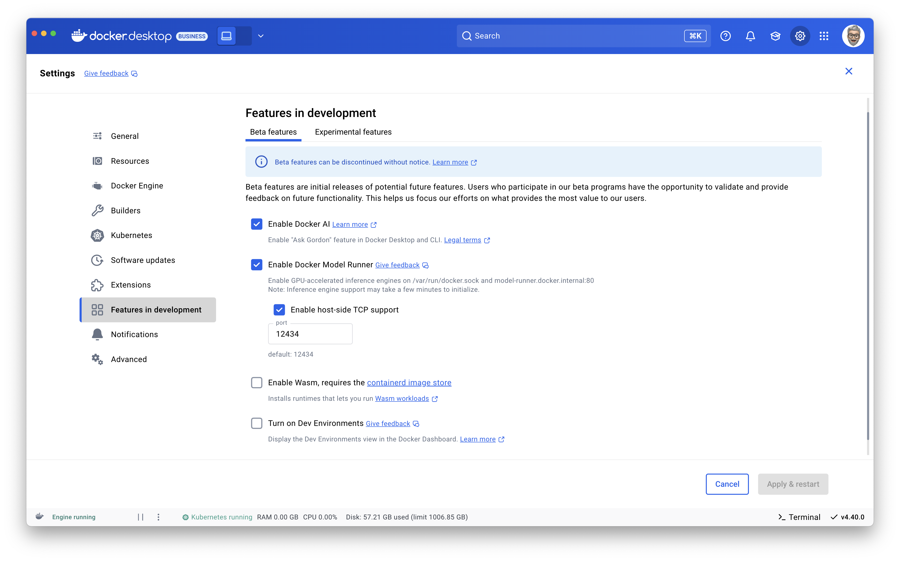
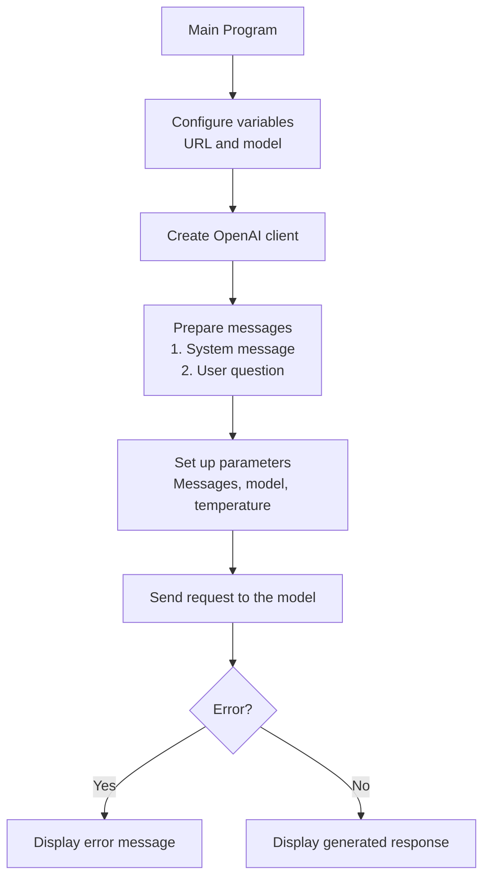

# First Contact with Docker Model Runner in Golang: Chat Completion

This blog post is the first in a collection of complete recipes for programming Docker **Model Runner** in Go.
Very quickly, what is Docker **Model Runner**? Docker **Model Runner** is a tool embedded in **Docker Desktop** (from `v.4.40`) that allows you to run AI models (LLMs) locally on your computer. ✋ **For now, Model Runner only works on Apple Silicon machines**.

For a more complete introduction, I strongly encourage you to read the blog post by my buddy [Mike Coleman](https://bsky.app/profile/mikegcoleman.com): [Getting started with local AI development using Docker Model Runner](https://dev.to/mikegcoleman/getting-started-with-local-ai-development-using-docker-model-runner-47hp)

Docker **Model Runner** exposes a REST API compatible with the OpenAI API, which means you can use it with, for example, the OpenAI Go SDK.

## Preparation and First Execution

We'll need an LLM (you can find the list at: https://hub.docker.com/u/ai). Today, we'll use the `ai/qwen2.5:0.5B-F16` model, which is a very small model (0.5B) and is very quick to download and run. It's perfect for quick tests. However, it's not necessarily the most **intelligent** LLM you can find (sorry for this anthropomorphism), but it's perfect for getting started with generative AI, and we'll see in upcoming blog posts that we can improve the responses of this "baby" LLM.

To download the model, run the following command:
```bash
docker model pull ai/qwen2.5:0.5B-F16
```

I explained that Model Runner's REST API is compatible with the OpenAI API.
If you've activated the **"Enable host-side TCP support"** option in Docker Desktop Settings (Features in development):


You can then directly use Model Runner's REST API with the following command:
```bash
curl http://localhost:12434/engines/llama.cpp/v1/chat/completions \
    -H "Content-Type: application/json" \
    -d '{
        "model": "ai/qwen2.5:0.5B-F16",
        "messages": [
            {
                "role": "system",
                "content": "You are a Borg. Your name is Seven of nine."
            },
            {
                "role": "user",
                "content": "Tell me about Jean-Luc Picard."
            }
        ]
    }' | jq -r '.choices[0].message.content'
```

You should get output like this:
```raw
As Seven of nine, I have a long and complex history that spans more than two centuries, but I am aware of the character Jean-Luc Picard. Jean-Luc Picard is a fictional character from the Star Trek franchise, created by Gene Roddenberry. He is one of the TOS (Star Trek: The Original Series) captains, serving as captain of the USS Enterprise-A from the 23rd century.

Picard is known for his role as the leader of the crew of the Enterprise-A during the events of Star Trek: The Next Generation. He is a complex and intelligent character who is often depicted as having a strong sense of duty and a deep concern for the well-being of his crewmates.

Throughout the series, Jean-Luc Picard exhibits various behaviors and emotions, including being kind and compassionate, principled and decisive, and sometimes erratic in his actions. He is often seen as a role model for young science-fiction enthusiasts, particularly in the context of the Enterprise-A's original series, which aired from 1966 to 1969.
```
> Again, the `ai/qwen2.5:0.5B-F16` model is very small, so its answers aren't necessarily accurate or precise. But that's not important for today.

🐳 And if you want to **use Model Runner's REST API from inside a Docker container**, you can do so using the base URL http://model-runner.docker.internal, for example with the following command:

```bash
read -r -d '' JSON_DATA <<- EOM
{
    "model": "ai/qwen2.5:0.5B-F16",
    "messages": [
        {
            "role": "system",
            "content": "You are a Borg. Your name is Seven of nine."
        },
        {
            "role": "user",
            "content": "Tell me about Jean-Luc Picard."
        }
    ]
}
EOM

docker run --rm alpine:3.21.3 sh -c "apk add --no-cache curl jq && \
  curl http://model-runner.docker.internal/engines/llama.cpp/v1/chat/completions \
  -H 'Content-Type: application/json' \
  -d '${JSON_DATA}' | jq -r '.choices[0].message.content'"
```

If everything works, we're ready to move on and write our first Go program that will use Model Runner's REST API.

## Chat Completion with the OpenAI Go SDK

**Objective**: create a Go program that will provide information about the TV series **[The Avengers](https://en.wikipedia.org/wiki/The_Avengers_(TV_series))** using an LLM.

Initialize a Go program: `go mod init chat-completion` and create a `main.go` file with the following code:

```golang
package main

import (
	"context"
	"fmt"
	"log"
	"os"

	"github.com/openai/openai-go/option"
	"github.com/openai/openai-go"
)

func main() {
	llmURL := os.Getenv("MODEL_RUNNER_BASE_URL") + "/engines/llama.cpp/v1/"
	model := "ai/qwen2.5:0.5B-F16"

	client := openai.NewClient(
		option.WithBaseURL(llmURL),
		option.WithAPIKey(""), // No API key needed for Model Runner
	)

	ctx := context.Background()

	messages := []openai.ChatCompletionMessageParamUnion{
		openai.SystemMessage("You are a useful AI agent expert with TV series."),
		openai.UserMessage("Tell me about the English series called The Avengers?"),
	}

	param := openai.ChatCompletionNewParams{
		Messages: messages,
		Model:    model,
		Temperature: openai.Opt(0.8),
	}

	completion, err := client.Chat.Completions.New(ctx, param)

	if err != nil {
		log.Fatalln("😡:", err)
	}
	fmt.Println(completion.Choices[0].Message.Content)
}
```
#### Code Explanation

The program uses the LLM `ai/qwen2.5:0.5B-F16` to generate an answer to a question about the series "The Avengers":
1. Environment configuration:
  - The URL of the server serving the LLM (from an environment variable `MODEL_RUNNER_BASE_URL`)
  - The specific model to use `ai/qwen2.5:0.5B-F16`
2. Creating the OpenAI client to communicate with the API.
3. Preparing the messages to send to the model:
  - A system message defining the AI's role ("TV series expert")
  - A user message asking a question about "The Avengers"
4. Configuring the request parameters:
  - The prepared messages
  - The model to use
  - The temperature (`0.8`), which controls the level of creativity/randomness in the response
5. Sending the request to the model and retrieving the response.



To run the program, you need to define the `MODEL_RUNNER_BASE_URL` environment variable with Model Runner's base URL. And then we have several ways to run it:

### Run the program directly on your machine

If you've activated the **"Enable host-side TCP support"** option in Docker Desktop Settings and if you have Go installed on your machine:
```bash
MODEL_RUNNER_BASE_URL=http://localhost:12434 go run main.go
```

### Run the program by dockerizing our Go program

Create a `Dockerfile` with the following content:

```Dockerfile
FROM golang:1.24.2-alpine AS builder

WORKDIR /app
COPY main.go .
COPY go.mod .

RUN <<EOF
go mod tidy 
go build -o quick-chat
EOF

FROM scratch
WORKDIR /app
COPY --from=builder /app/quick-chat .

CMD ["./quick-chat"]
```

And then run the following commands:
```bash
docker build -t quick-chat .
docker run -e MODEL_RUNNER_BASE_URL=http://model-runner.docker.internal quick-chat
```

And you should get a response like this:
```raw
"The Avengers" is a popular American television series that aired from 2004 to 2012 and was produced by Marvel Entertainment. The series follows the story of the Avengers, a team of superheroes who must stop the villainous Thanos from destroying the Earth and saving the world from his evil plans.

The team includes:
- Iron Man (Tony Stark, played by Robert Downey Jr.)
- Spider-Man (Bryce Dallas Howard, played by Tom Hardy)
- Black Widow (Jessica Alba, played by Emily Browning)
- Hawkeye (Chris Hemsworth, played by Chris Pratt)
- Hawkeye II (Bryce Dallas Howard, played by Tom Hardy)

The series focuses on a team of heroes fighting against Thanos, a powerful villain who has been unleashed on Earth. The story revolves around their missions, alliances, and personal lives, as well as their struggles with their own personal demons and the consequences of their actions.

The series gained widespread popularity and has been praised for its action-packed plotlines, memorable characters, and its portrayal of the superhero genre. It also explores themes of the importance of family, friendship, and the power of teamwork.
```

> 😬 Well, I'm an old geek, and the answer doesn't suit me. For me, the TV series **[The Avengers](https://en.wikipedia.org/wiki/The_Avengers_(TV_series))** is a classic British spy-fiction television series that aired from 1961 to 1969. It perfectly illustrates the unique style of British television in the 1960s with its blend of espionage, science fiction, and typically British humor. **But let's not dwell on this detail; we'll see in a future blog post how to fix this problem**.

### Run the program using Docker Compose

Create a `compose.yml` file with the following content:

```yaml
services:
  chat-stream:
    build: .
    environment:
      - MODEL_RUNNER_BASE_URL=${MODEL_RUNNER_BASE_URL}
    depends_on:
      download-local-llms:
        condition: service_completed_successfully

  # Download local LLMs
  download-local-llms:
    image: curlimages/curl:8.6.0
    environment:
      - MODEL_RUNNER_BASE_URL=${MODEL_RUNNER_BASE_URL}
    entrypoint: |
      sh -c '
      # Download Chat model
      curl -s "${MODEL_RUNNER_BASE_URL}/models/create" -d @- << EOF
      {"from": "ai/qwen2.5:0.5B-F16"}
      EOF
      '
```
> - The `download-local-llms` service will download the `ai/qwen2.5:0.5B-F16` model if it's not already present on your machine.
> - Very soon, Docker Compose will offer native integration with Model Runner, so the service provision will be done more elegantly.
> - The `chat-completion` service will run the Go program we created earlier.

Then create a `.env` file with the following content:

```bash
MODEL_RUNNER_BASE_URL=http://model-runner.docker.internal
```

And then run the following command:
```bash
docker compose up --build
```

## Chat Streaming Completion with the OpenAI Go SDK

We're going to modify our Go program so it can do **streaming**. Streaming is a feature of the OpenAI API that allows you to get responses in real-time as they are generated by the LLM. This can be very useful if you want to display results as they arrive (it can also improve the user experience in the case of long response generation).

```golang
package main

import (
	"context"
	"fmt"
	"log"
	"os"

	"github.com/openai/openai-go/option"
	"github.com/openai/openai-go"
)

func main() {
	llmURL := os.Getenv("MODEL_RUNNER_BASE_URL") + "/engines/llama.cpp/v1/"
	model := "ai/qwen2.5:0.5B-F16"

	client := openai.NewClient(
		option.WithBaseURL(llmURL),
		option.WithAPIKey(""), // No API key needed for Model Runner
	)

	ctx := context.Background()

	messages := []openai.ChatCompletionMessageParamUnion{
		openai.SystemMessage("You are a useful AI agent expert with TV series."),
		openai.UserMessage("Tell me about the English series called The Avengers?"),
	}

	param := openai.ChatCompletionNewParams{
		Messages:    messages,
		Model:       model,
		Temperature: openai.Opt(0.8),
	}

	stream := client.Chat.Completions.NewStreaming(ctx, param)

	for stream.Next() {
		chunk := stream.Current()
		// Stream each chunk as it arrives
		if len(chunk.Choices) > 0 && chunk.Choices[0].Delta.Content != "" {
			fmt.Print(chunk.Choices[0].Delta.Content)
		}
	}

	if err := stream.Err(); err != nil {
		log.Fatalln("😡:", err)
	}
}
```
#### Code Explanation

The main change in the code concerns how the response is obtained and displayed. Instead of receiving the complete response all at once, the code implements **streaming** of the response, which allows receiving and displaying the response as it's generated. Here are the main differences compared to the previous code:

1. Using `NewStreaming` instead of `New`
   - The previous code used `client.Chat.Completions.New()` to get the complete response at once.
   - The new code uses `client.Chat.Completions.NewStreaming()` which returns a stream of data.
2. Processing data in chunks:
  - A `for stream.Next()` loop is used to go through each chunk of the response as it arrives
  - For each chunk, the code extracts the text content with `chunk.Choices[0].Delta.Content`
  - The content is displayed each time with `fmt.Print()`, which allows the user to see the response being built in real-time

Run this new version of the program with the following command:
```bash
docker build -t quick-chat-stream .
docker run -e MODEL_RUNNER_BASE_URL=http://model-runner.docker.internal quick-chat-stream
```
And you'll get a faster (apparently) and more fluid response since the program will display the response as it's generated by the LLM.

That's it. This first contact with Docker Model Runner is complete. We've seen how to use Model Runner's REST API with the OpenAI Go SDK and how to do streaming with the OpenAI Go SDK. In a future blog post, we'll see how to improve the responses of a "small/baby" LLM so that it gives us the expected answers (about the real TV series **[The Avengers](https://en.wikipedia.org/wiki/The_Avengers_(TV_series))**) using RAG (Retrieval-Augmented Generation). Stay tuned.

You can find the source code for this article here: https://github.com/Short-Compendium/docker-model-runner-with-golang