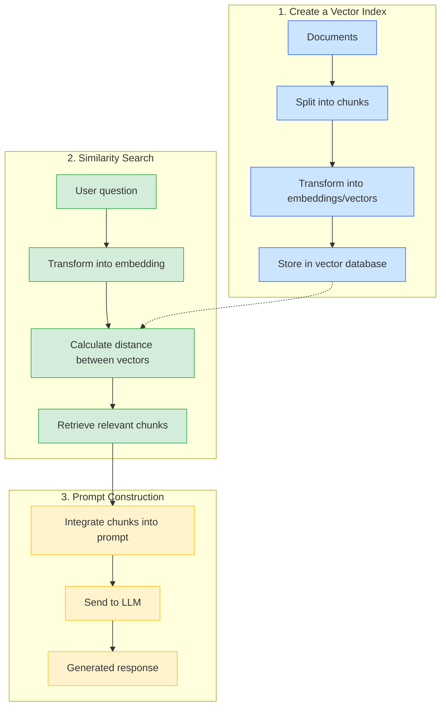

# RAG from scratch with Docker Model Runner - Part 1
> And similarity search between embeddings

A LLM is not trained on "all the data in the world". Moreover, data evolves (updates, new information, ...). There's little chance it knows your company's document repository. And the "smaller" a LLM is, the less knowledge it will have; remember my previous blog post [](), when I discuss with `ai/qwen2.5:0.5B-F16` about **Avengers**, it knows Marvel's **Avengers**, but not the **Avengers** from the British series [The Avengers](https://en.wikipedia.org/wiki/The_Avengers_(TV_series)).

How can we educate a LLM on data it doesn't have? One solution would be to train it on this data, but that takes a lot of time and especially a lot of resources, and therefore money - all of which is bad for the planet... and the wallet.

Another solution is to set up a **RAG** (Retrieval-Augmented Generation) system.

This first part will allow us to lay the foundations of **RAG** to understand how it works. The second part (in a future blog post) will be dedicated to setting up a **RAG** system to teach `ai/qwen2.5:0.5B-F16` who the "real" **Avengers** are.

## What is RAG?
> I will focus solely on textual data.

The principle of RAG can be summarized in 3 steps:

### 1. Create a vector index
First, we will create a sort of **"vector index"** from a set of documents:

- We select a set of documents.
- Then we "cut" these documents into smaller pieces (chunks)
- Next, we will transform the semantic meaning of these pieces into numerical data. We call this numerical data **vectors** or **embeddings**.
- Then we will store these **embeddings** (and the associated texts) in, for example, a vector database.

### 2. Similarity search

Once we have this vector database (it could very well be an in-memory map system), we can calculate distances between vectors. So we can find the pieces of documents that are semantically closest to a question asked by the user.

In other words, if we calculate the embeddings of the question asked by the user, we can then calculate the **distance** between this vector and the vectors in the vector database. We will therefore be able to find the pieces of documents (chunks) that are semantically closest to the question asked by the user. This is what we call **similarity search**.

### 3. Building a prompt for the LLM

Once we have found the pieces of documents that are semantically closest to the question asked by the user, we can build a prompt for the LLM, like this for example:

Let's imagine that my chunks are the following:
```text
- Lions run in the savannah
- Birds fly in the sky
- Frogs swim in the pond
- Fish swim in the sea
```

If my question is: **"Which animals swim?"**, the similarity search should return the following pieces of documents:
```text
- Frogs swim in the pond
- Fish swim in the sea
```

So we will build a prompt for the LLM like this:
```golang
messages := []openai.ChatCompletionMessageParamUnion{
    openai.SystemMessage(`
    You are a helpful assistant. 
    Answer the question based onlyon the following context:
    `),
    openai.SystemMessage(`CONTEXT:
    Frogs swim in the pond
    Fish swim in the sea
    `),
    openai.UserMessage("Which animals swim?"),
}
```

And if all goes well, the LLM should answer something like:
```text
Frogs and the fish swim...
```



But today we'll focus on creating embeddings with **Docker Model Runner** and similarity search. Building the prompt for the LLM will be the subject of the next blog post.

## Creating embeddings with the Docker Model Runner REST API

Some LLMs are capable of creating embeddings from a piece of text. Let's see how to do this with **Docker Model Runner** and the `ai/mxbai-embed-large` model ([https://hub.docker.com/r/ai/mxbai-embed-large](https://hub.docker.com/r/ai/mxbai-embed-large)).

We'll first download the `ai/mxbai-embed-large` model to our local machine:
```bash
docker model pull ai/mxbai-embed-large
```

Then if you invoke the **Docker Model Runner** REST API:
```bash
curl http://localhost:12434/engines/llama.cpp/v1/embeddings \
  -H "Content-Type: application/json" \
  -d '{
    "input": "Lions run in the savannah",
    "model": "ai/mxbai-embed-large",
    "encoding_format": "float"
  }'
```

You'll get a response like:
```json
{
  "model": "ai/mxbai-embed-large",
  "object": "list",
  "usage": {
    "prompt_tokens": 7,
    "total_tokens": 7
  },
  "data": [
    {
      "embedding": [
        0.03612098842859268,
        0.06824947893619537,
        0.03915918618440628,
        -0.008933821693062782,
        -0.007150621153414249,
        ...
        0.03239960968494415
      ],
      "index": 0,
      "object": "embedding"
    }
  ]
}
```
Now you know how to create embeddings from a piece of text with **Docker Model Runner**. Let's see how to do this in Go with the OpenAI Go SDK.

## Creating embeddings with the OpenAI Go SDK

To calculate embeddings from a string, you need to use the `Embeddings.New` method of the OpenAI Go SDK. Here's an example code that does this:

```go
userQuestion := "Which animals swim?"

embeddingsFromUserQuestion, err := client.Embeddings.New(ctx, openai.EmbeddingNewParams{
    Input: openai.EmbeddingNewParamsInputUnion{
        OfString: openai.String(userQuestion),
    },
    Model: embeddingsModel,
})
if err != nil {
    fmt.Println(err)
} else {
    fmt.Println("❓ Embeddings from question:", userQuestion)
    // Display the first 3 values of the embedding
    fmt.Println(embeddingsFromUserQuestion.Data[0].Embedding[:3],"...")
}
```

## Initializing the Go program and Dockerizing the same program

### Creating the Go program

Let's create a first program that will calculate the embeddings for the user's question and for a set of chunks.
```bash
go mod init embeddings-demo
touch main.go
go mod tidy
```

> `main.go`:
```golang
package main

import (
	"context"
	"fmt"
	"os"

	"github.com/openai/openai-go"
	"github.com/openai/openai-go/option"
)

var chunks = []string{
	`Lions run in the savannah`,
	`Birds fly in the sky`,
	`Frogs swim in the pond`,
	`Fish swim in the sea`,
}

func main() {
	ctx := context.Background()

	llmURL := os.Getenv("MODEL_RUNNER_BASE_URL") + "/engines/llama.cpp/v1/"
	embeddingsModel := "ai/mxbai-embed-large"

	client := openai.NewClient(
		option.WithBaseURL(llmURL),
		option.WithAPIKey(""),
	)

	// -------------------------------------------------
	// Generate embeddings from user question
	// -------------------------------------------------
	userQuestion := "Which animals swim?"

	fmt.Println("⏳ Creating embeddings from user question...")

	embeddingsFromUserQuestion, err := client.Embeddings.New(ctx, openai.EmbeddingNewParams{
		Input: openai.EmbeddingNewParamsInputUnion{
			OfString: openai.String(userQuestion),
		},
		Model: embeddingsModel,
	})
	if err != nil {
		fmt.Println(err)
	} else {
		fmt.Println("❓ Embeddings from question:", userQuestion)
		fmt.Println(embeddingsFromUserQuestion.Data[0].Embedding[:3],"...")
	}

	// -------------------------------------------------
	// Generate embeddings from chunks
	// -------------------------------------------------
	fmt.Println("⏳ Creating embeddings from chunks...")

	for _, chunk := range chunks {
		embeddingsResponse, err := client.Embeddings.New(ctx, openai.EmbeddingNewParams{
			Input: openai.EmbeddingNewParamsInputUnion{
				OfString: openai.String(chunk),
			},
			Model: embeddingsModel,
		})

		if err != nil {
			fmt.Println(err)
		} else {
			fmt.Println("📝 Embedding from chunk:", chunk)
			fmt.Println(embeddingsResponse.Data[0].Embedding[:3], "...")
		}
	}

}
```

You can now run the program:

```bash
go mod tidy
MODEL_RUNNER_BASE_URL=http://localhost:12434 go run main.go
```

And you'll get an output like:
```bash
⏳ Creating embeddings from user question...
❓ Embeddings from question: Which animals swim?
[0.018600577488541603 0.061115678399801254 -0.01301580760627985] ...
⏳ Creating embeddings from chunks...
📝 Embedding from chunk: The lions run in the savannah
[0.037704985588788986 0.06324923783540726 0.03572160750627518] ...
📝 Embedding from chunk: The birds fly in the sky
[-0.013265078887343407 0.033723294734954834 0.01774625852704048] ...
📝 Embedding from chunk: The frogs swim in the pond
[0.02042732946574688 0.01432869490236044 -0.008206491358578205] ...
📝 Embedding from chunk: The fish swim in the sea
[0.026572521775960922 0.013014586642384529 -0.0355021208524704] ...
```

### Dockerizing the program

Now let's dockerize the program. For this, we'll create a `Dockerfile` and a `compose.yml` file.

> `Dockerfile`:
```Dockerfile
FROM golang:1.24.2-alpine AS builder

WORKDIR /app
COPY main.go .
COPY go.mod .

RUN <<EOF
go mod tidy 
go build -o quick-rag
EOF

FROM scratch
WORKDIR /app
COPY --from=builder /app/quick-rag .

CMD ["./quick-rag"]
```

> `compose.yml`:
```yaml
# docker compose up --build --no-log-prefix
services:
  run-rag:
    build: .
    environment:
      - MODEL_RUNNER_BASE_URL=${MODEL_RUNNER_BASE_URL}
    depends_on:
      download-local-llms:
        condition: service_completed_successfully

  # Download local Docker Model Runner LLMs
  download-local-llms:
    image: curlimages/curl:8.12.1
    environment:
      - MODEL_RUNNER_BASE_URL=${MODEL_RUNNER_BASE_URL}
    entrypoint: |
      sh -c '      
      # Download Embedding model
      curl -s "${MODEL_RUNNER_BASE_URL}/models/create" -d @- << EOF
      {"from": "ai/mxbai-embed-large"}
      EOF
      '

```
> **Note**: the `download-local-llms` service allows downloading the `ai/mxbai-embed-large` model, if it already exists, the cache will be used.

You can now run the program as follows:
```bash 
docker compose up --build --no-log-prefix
```

There we go, we now have the basic program to calculate **embeddings** using a LLM. Now we need to learn how to calculate distances between embeddings (find the most similar/closest embeddings).

## Calculate similarity between embeddings

Generally, vector databases are capable of calculating similarity between embeddings. But we'll do it manually to understand how it works.

For this we'll use the **[cosine similarity](https://en.wikipedia.org/wiki/Cosine_similarity)** method between 2 vectors:

- **Cosine similarity** measures the **similarity** between two vectors by calculating the cosine of the angle that separates them.
- The more similar the vectors are, the closer the cosine will be to 1.
- In other words: the higher the value, the more similar the vectors are
- The distance varies between `-1` and `1`
- `1` means the vectors are identical (same direction)
- `-1` means they point in opposite directions

### Go implementation of cosine similarity

Creating a `CosineSimilarity` function in Go is quite simple:

Create a subfolder `rag` and a file `cosine-similarity.go` in your project:

> `rag/cosine-similarity.go`:
```golang
package rag

import (
	"math"
)

func dotProduct(v1 []float64, v2 []float64) float64 {
	// Calculate the dot product of two vectors
	sum := 0.0
	for i := range v1 {
		sum += v1[i] * v2[i]
	}
	return sum
}

// CosineSimilarity calculates the cosine similarity between two vectors
func CosineSimilarity(v1, v2 []float64) float64 {
	// Calculate the cosine distance between two vectors
	product := dotProduct(v1, v2)

	norm1 := math.Sqrt(dotProduct(v1, v1))
	norm2 := math.Sqrt(dotProduct(v2, v2))
	if norm1 <= 0.0 || norm2 <= 0.0 {
		// Handle potential division by zero
		return 0.0
	}
	return product / (norm1 * norm2)
}
```

### Using the `CosineSimilarity` function

Modify the `main.go` file to use the `CosineSimilarity` function to calculate the similarity between the embeddings of the user's question and each of the embeddings of the chunks:

```golang
package main

import (
	"context"
	"embeddings-demo/rag"
	"fmt"
	"os"

	"github.com/openai/openai-go"
	"github.com/openai/openai-go/option"
)

var chunks = []string{
	`Lions run in the savannah`,
	`Birds fly in the sky`,
	`Frogs swim in the pond`,
	`Fish swim in the sea`,
}

func main() {
	ctx := context.Background()

	llmURL := os.Getenv("MODEL_RUNNER_BASE_URL") + "/engines/llama.cpp/v1/"
	embeddingsModel := "ai/mxbai-embed-large"

	client := openai.NewClient(
		option.WithBaseURL(llmURL),
		option.WithAPIKey(""),
	)

	// -------------------------------------------------
	// Generate embeddings from user question
	// -------------------------------------------------
	userQuestion := "Which animals swim?"

	fmt.Println("⏳ Creating embeddings from user question...")

	embeddingsFromUserQuestion, err := client.Embeddings.New(ctx, openai.EmbeddingNewParams{
		Input: openai.EmbeddingNewParamsInputUnion{
			OfString: openai.String(userQuestion),
		},
		Model: embeddingsModel,
	})
	if err != nil {
		fmt.Println(err)
	}

	// -------------------------------------------------
	// Generate embeddings from chunks
	// -------------------------------------------------
	fmt.Println("⏳ Creating embeddings from chunks...")

	for _, chunk := range chunks {
		embeddingsResponse, err := client.Embeddings.New(ctx, openai.EmbeddingNewParams{
			Input: openai.EmbeddingNewParamsInputUnion{
				OfString: openai.String(chunk),
			},
			Model: embeddingsModel,
		})

		if err != nil {
			fmt.Println(err)
		} else {
			cosineSimilarity := rag.CosineSimilarity(
				embeddingsResponse.Data[0].Embedding,
				embeddingsFromUserQuestion.Data[0].Embedding,
			)
			fmt.Println("🔗 Cosine similarity with ", chunk, "=", cosineSimilarity)
		}
	}
}
```

Update the `Dockerfile` to include the `rag` package with `COPY rag/ ./rag/`:
```Dockerfile
FROM golang:1.24.2-alpine AS builder

WORKDIR /app
COPY main.go .
COPY rag/ ./rag/ 
COPY go.mod .

RUN <<EOF
go mod tidy 
go build -o quick-rag
EOF

FROM scratch
WORKDIR /app
COPY --from=builder /app/quick-rag .

CMD ["./quick-rag"]
```

Run the program again:
```bash
docker compose up --build --no-log-prefix
```

And you'll get an output like:
```bash
⏳ Creating embeddings from user question...
⏳ Creating embeddings from chunks...
🔗 Cosine similarity with  Lions run in the savannah = 0.5076706598554476
🔗 Cosine similarity with  Birds fly in the sky = 0.4902228037793251
🔗 Cosine similarity with  Frogs swim in the pond = 0.66502169609195
🔗 Cosine similarity with  Fish swim in the sea = 0.7203000041392786
```

You can see that the two highest similarity values correspond to chunks that talk about animals that swim: `Frogs swim in the pond` and `Fish swim in the sea`.

**Semantic Network Graph showing relationships between all text chunks based on cosine similarity**:


> Closer nodes and thicker lines indicate higher similarity.


## Conclusion

There you have it, now you know how to create embeddings from a piece of text and how to calculate the similarity between these embeddings.
In the next blog post, we'll see how to create an "in memory vector store" to store embeddings with a similarity search function between embeddings. And then how to use the results to build a prompt for the LLM.


You can find the source code for this article here: [https://github.com/Short-Compendium/docker-model-runner-with-golang/tree/main/02-embeddings-distances](https://github.com/Short-Compendium/docker-model-runner-with-golang/tree/main/02-embeddings-distances).
