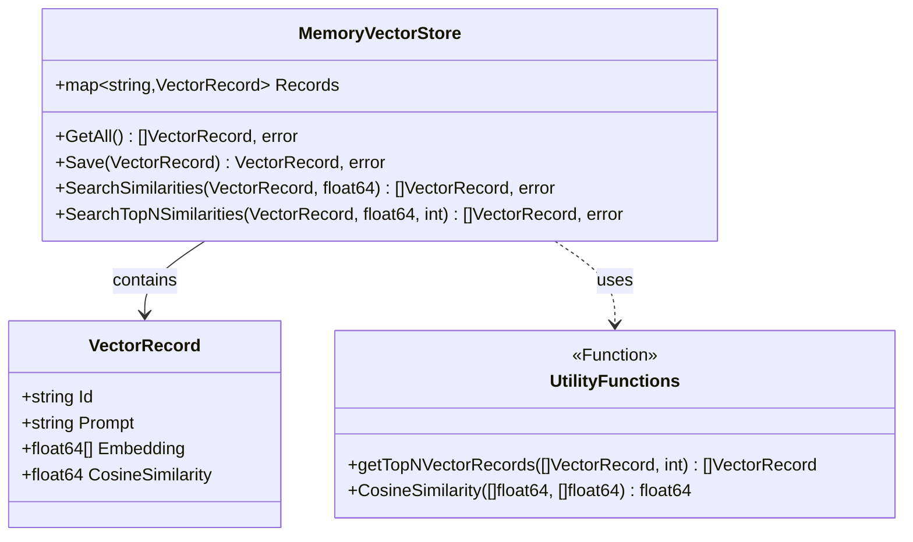
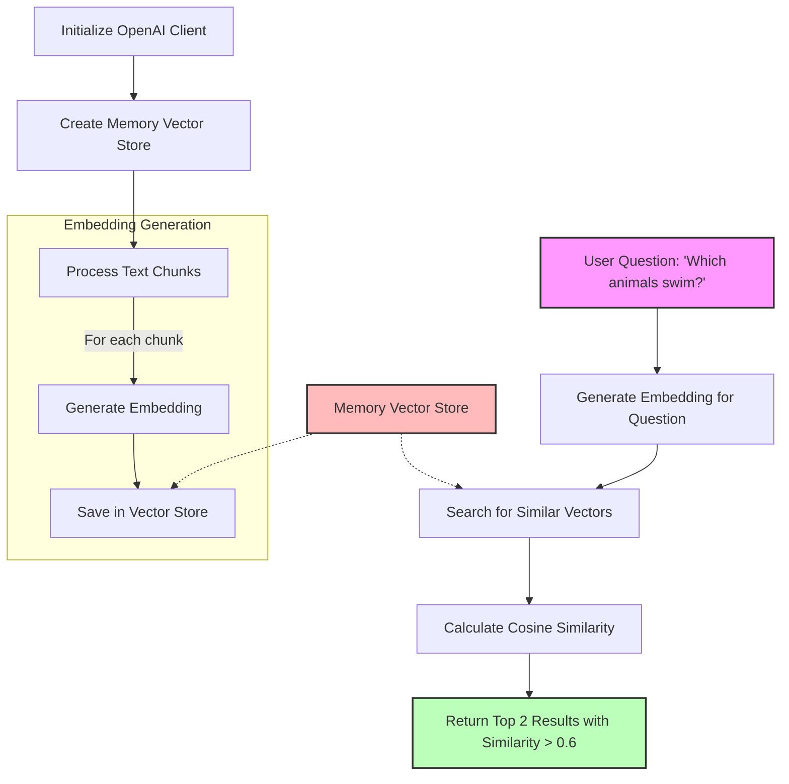
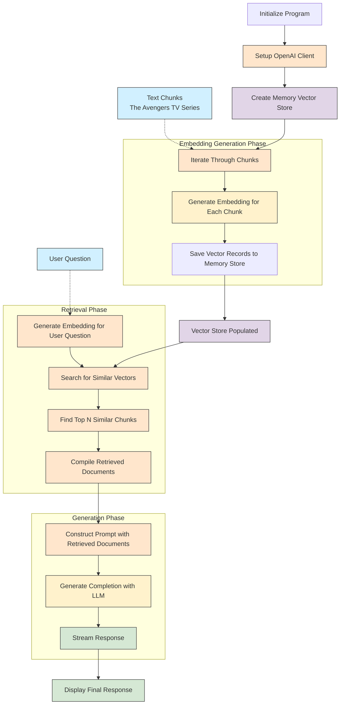

# RAG from scratch with Docker Model Runner - Part 2
> Make my tiny model smarter

This blog post is a bit longer than the previous two, so go grab yourself a good coffee ☕️.

In the first part about RAG ([RAG from scratch with Docker Model Runner - Part 1](https://k33g.hashnode.dev/rag-from-scratch-with-docker-model-runner-part-1)), we saw how to calculate Cosine similarity between embeddings of sentences to find sentences most similar to a query sentence.

Today we're going to check if this can help us improve the results of the LLM `ai/qwen2.5:0.5B-F16` used for the first blog post in the series ([First Contact with Docker Model Runner in Golang](https://k33g.hashnode.dev/first-contact-with-docker-model-runner-in-golang)) regarding its knowledge of the British TV series [The Avengers](https://en.wikipedia.org/wiki/The_Avengers_(TV_series)).

So we're going to see how to use similarity search results in a chat completion prompt for an LLM.

But first, we're going to modify the code from the previous blog post to create an **"in-memory Vector Store"** to store our embeddings. And we'll delegate the responsibility of similarity search to it (still using the LLM `ai/mxbai-embed-large`).

## Vector Store

We're going to implement an in-memory vector storage and search system, which will be part of our RAG (Retrieval-Augmented Generation) system.

In the `rag` folder, you'll create a `rag.go` file that will contain the implementation of what follows.

### Graphical representation of our Vector Store system



This diagram illustrates the relationships between the `VectorRecord` and `MemoryVectorStore` structures, as well as the utility functions. The `MemoryVectorStore` structure contains instances of `VectorRecord` and uses utility functions for its search operations.

### Package structure

The code is defined in a package named `rag`.

### Imports

```go
import (
    "sort"
    "github.com/google/uuid"
)
```

- The `sort` package is used to sort vectors according to their similarity.
- `github.com/google/uuid` is used to generate unique identifiers.

### Structures

#### VectorRecord

```go
type VectorRecord struct {
    Id               string    `json:"id"`
    Prompt           string    `json:"prompt"`
    Embedding        []float64 `json:"embedding"`
    CosineSimilarity float64
}
```

This structure represents a vector record with:
- `Id`: a unique identifier in string form
- `Prompt`: the input text associated with this vector (the **chunk**)
- `Embedding`: an array of floating point numbers representing the vector embedding
- `CosineSimilarity`: a score calculated when comparing with other vectors

#### MemoryVectorStore

```go
type MemoryVectorStore struct {
    Records map[string]VectorRecord
}
```

This structure represents an in-memory vector store, using a map where keys are strings (IDs) and values are instances of `VectorRecord`.

### Methods

#### GetAll

```go
func (mvs *MemoryVectorStore) GetAll() ([]VectorRecord, error) {
    var records []VectorRecord
    for _, record := range mvs.Records {
        records = append(records, record)
    }
    return records, nil
}
```

This method returns all vector records stored in the store as a slice.

#### Save

```go
func (mvs *MemoryVectorStore) Save(vectorRecord VectorRecord) (VectorRecord, error) {
    if vectorRecord.Id == "" {
        vectorRecord.Id = uuid.New().String()
    }
    mvs.Records[vectorRecord.Id] = vectorRecord
    return vectorRecord, nil
}
```

This method saves a `VectorRecord` in the store. If the ID is empty, a new UUID is generated.

#### SearchSimilarities

```go
func (mvs *MemoryVectorStore) SearchSimilarities(embeddingFromQuestion VectorRecord, limit float64) ([]VectorRecord, error) {
    var records []VectorRecord
    for _, v := range mvs.Records {
        distance := CosineSimilarity(embeddingFromQuestion.Embedding, v.Embedding)
        if distance >= limit {
            v.CosineSimilarity = distance
            records = append(records, v)
        }
    }
    return records, nil
}
```

This method searches for vectors similar to a query vector:
- It takes a reference vector and a similarity threshold
- For each vector in the store, it calculates the cosine similarity
- It returns all vectors whose similarity is greater than or equal to the threshold
- The cosine similarity is stored in each returned vector

#### SearchTopNSimilarities

```go
func (mvs *MemoryVectorStore) SearchTopNSimilarities(embeddingFromQuestion VectorRecord, limit float64, max int) ([]VectorRecord, error) {
    records, err := mvs.SearchSimilarities(embeddingFromQuestion, limit)
    if err != nil {
        return nil, err
    }
    return getTopNVectorRecords(records, max), nil
}
```

This method extends `SearchSimilarities` by returning only the top N results:
- It uses `SearchSimilarities` to get all similar vectors
- Then calls `getTopNVectorRecords` to filter the top N

#### getTopNVectorRecords

```go
func getTopNVectorRecords(records []VectorRecord, max int) []VectorRecord {
    sort.Slice(records, func(i, j int) bool {
        return records[i].CosineSimilarity > records[j].CosineSimilarity
    })

    if len(records) < max {
        return records
    }
    return records[:max]
}
```

This utility function:
- Sorts vectors in descending order of cosine similarity
- Returns either all vectors if their number is less than `max`, or the first `max` vectors

### Complete source code

> `rag.go`
```go
package rag

import (
	"sort"
	"github.com/google/uuid"
)

type VectorRecord struct {
	Id               string    `json:"id"`
	Prompt           string    `json:"prompt"`
	Embedding        []float64 `json:"embedding"`
	CosineSimilarity float64
}

type MemoryVectorStore struct {
	Records map[string]VectorRecord
}

func (mvs *MemoryVectorStore) GetAll() ([]VectorRecord, error) {
	var records []VectorRecord
	for _, record := range mvs.Records {
		records = append(records, record)
	}
	return records, nil
}

func (mvs *MemoryVectorStore) Save(vectorRecord VectorRecord) (VectorRecord, error) {
	if vectorRecord.Id == "" {
		vectorRecord.Id = uuid.New().String()
	}
	mvs.Records[vectorRecord.Id] = vectorRecord
	return vectorRecord, nil
}

func (mvs *MemoryVectorStore) SearchSimilarities(embeddingFromQuestion VectorRecord, limit float64) ([]VectorRecord, error) {

	var records []VectorRecord

	for _, v := range mvs.Records {
		distance := CosineSimilarity(embeddingFromQuestion.Embedding, v.Embedding)
		if distance >= limit {
			v.CosineSimilarity = distance
			records = append(records, v)
		}
	}
	return records, nil
}

func (mvs *MemoryVectorStore) SearchTopNSimilarities(embeddingFromQuestion VectorRecord, limit float64, max int) ([]VectorRecord, error) {
	records, err := mvs.SearchSimilarities(embeddingFromQuestion, limit)
	if err != nil {
		return nil, err
	}
	return getTopNVectorRecords(records, max), nil
}

func getTopNVectorRecords(records []VectorRecord, max int) []VectorRecord {
	// Sort the records slice in descending order based on CosineDistance
	sort.Slice(records, func(i, j int) bool {
		return records[i].CosineSimilarity > records[j].CosineSimilarity
	})

	// Return the first max records or all if less than three
	if len(records) < max {
		return records
	}
	return records[:max]
}
```

Now let's see how to put this into practice in our previous example.

## Using the Vector Store

The code implements a simple Retrieval-Augmented Generation (RAG) system that uses embeddings to find semantic similarities between texts (chunks). It will work as follows:

1. It creates an in-memory "vector store" to store the embeddings.
2. For each sentence in the chunks:
   - It generates a vector embedding using the `ai/mxbai-embed-large` model
   - It saves this embedding in the vector store with the corresponding sentence
3. It takes a user question (`"Which animals swim?"`)
4. It generates an embedding for this user question
5. It searches for the sentences most similar to the question by calculating the cosine similarity between embeddings
6. It displays the results of the most similar sentences with a score above 0.6, limited to the top 2 results



The code that uses the Vector Store is as follows:
> main.go
```go
package main

import (
	"context"
	"embeddings-demo/rag"
	"fmt"
	"log"
	"os"

	"github.com/openai/openai-go"
	"github.com/openai/openai-go/option"
)

var chunks = []string{
	`The lions run in the savannah`,
	`The birds fly in the sky`,
	`The frogs swim in the pond`,
	`The fish swim in the sea`,
}

func main() {
	ctx := context.Background()

	llmURL := os.Getenv("MODEL_RUNNER_BASE_URL") + "/engines/llama.cpp/v1/"
	embeddingsModel := "ai/mxbai-embed-large"

	client := openai.NewClient(
		option.WithBaseURL(llmURL),
		option.WithAPIKey(""),
	)

	// -------------------------------------------------
	// Create a vector store
	// -------------------------------------------------
	store := rag.MemoryVectorStore{
		Records: make(map[string]rag.VectorRecord),
	}

	// -------------------------------------------------
	// Create and save the embeddings from the chunks
	// -------------------------------------------------
	fmt.Println("⏳ Creating embeddings from chunks...")

	for _, chunk := range chunks {
		embeddingsResponse, err := client.Embeddings.New(ctx, openai.EmbeddingNewParams{
			Input: openai.EmbeddingNewParamsInputUnion{
				OfString: openai.String(chunk),
			},
			Model: embeddingsModel,
		})

		if err != nil {
			fmt.Println(err)
		} else {
			_, errSave := store.Save(rag.VectorRecord{
				Prompt:    chunk,
				Embedding: embeddingsResponse.Data[0].Embedding,
			})

			if errSave != nil {
				fmt.Println("😡:", errSave)
			}
		}
	}

	fmt.Println("✋", "Embeddings created, total of records", len(store.Records))
	fmt.Println()

	// -------------------------------------------------
	// Search for similarities
	// -------------------------------------------------
	userQuestion := "Which animals swim?"

	fmt.Println("⏳ Searching for similarities...")

	// -------------------------------------------------
	// Create embedding from the user question
	// -------------------------------------------------
	embeddingsResponse, err := client.Embeddings.New(ctx, openai.EmbeddingNewParams{
		Input: openai.EmbeddingNewParamsInputUnion{
			OfString: openai.String(userQuestion),
		},
		Model: embeddingsModel,
	})
	if err != nil {
		log.Fatal("😡:", err)
	}
	// -------------------------------------------------
	// Create a vector record from the user embedding
	// -------------------------------------------------
	embeddingFromUserQuestion := rag.VectorRecord{
		Embedding: embeddingsResponse.Data[0].Embedding,
	}

	similarities, _ := store.SearchTopNSimilarities(embeddingFromUserQuestion, 0.6, 2)
	// if the limit is too close to 1, the risk is to lose the best match

	for _, similarity := range similarities {
		fmt.Println("✅ CosineSimilarity:", similarity.CosineSimilarity, "Chunk:", similarity.Prompt)
	}
	fmt.Println("✋", "Similarities found, total of records", len(similarities))

}
```

### Running the code

You have the option to run it directly:
```bash
MODEL_RUNNER_BASE_URL=http://localhost:12434 go run main.go
```
or using Docker Compose (we keep the same `compose.yml` file and the same `Dockerfile` as last time):
```bash
docker compose up --build --no-log-prefix
```

And you'll get the following result:
```bash
⏳ Creating embeddings from chunks...
✋ Embeddings created, total of records 4

⏳ Searching for similarities...
✅ CosineSimilarity: 0.6907790235125615 Chunk: The fish swim in the sea
✅ CosineSimilarity: 0.6572816406130678 Chunk: The frogs swim in the pond
✋ Similarities found, total of records 2
```

Which remains consistent with what we found in the previous blog post.

The code for this part is available here: [https://github.com/Short-Compendium/docker-model-runner-with-golang/tree/main/03-embeddings-distances](https://github.com/Short-Compendium/docker-model-runner-with-golang/tree/main/03-embeddings-distances).

Now, let's move on to the final step and see how to use these results to improve our LLM's responses.

## Adding search results to the prompt

For this part, we'll need a second model, a text completion model. We'll use the LLM `ai/qwen2.5:0.5B-F16` from [First Contact with Docker Model Runner in Golang](https://k33g.hashnode.dev/first-contact-with-docker-model-runner-in-golang).

### Modifying the `compose.yml` file

We're going to modify our `compose.yml` file to add this model:
```yaml
services:
  chat-stream:
    build: .
    command: go run main.go
    environment:
      - MODEL_RUNNER_BASE_URL=${MODEL_RUNNER_BASE_URL}
    depends_on:
      download-local-llms:
        condition: service_completed_successfully
    volumes:
      - ./:/app

  # Download local Docker Model Runner LLMs
  download-local-llms:
    image: curlimages/curl:8.12.1
    environment:
      - MODEL_RUNNER_BASE_URL=${MODEL_RUNNER_BASE_URL}
    entrypoint: |
      sh -c '
      # Download Chat model
      curl -s "${MODEL_RUNNER_BASE_URL}/models/create" -d @- << EOF
      {"from": "ai/qwen2.5:0.5B-F16"}
      EOF
      
      # Download Embedding model
      curl -s "${MODEL_RUNNER_BASE_URL}/models/create" -d @- << EOF
      {"from": "ai/mxbai-embed-large"}
      EOF
      '
```

### Changing the chunks

We're also going to change the chunks to make them more related to the British TV series [The Avengers](https://en.wikipedia.org/wiki/The_Avengers_(TV_series)).

```go
var chunks = []string{
	`# The Avengers
	"The Avengers" is a classic British spy-fi television series that aired from 1961 to 1969. 
	The show exemplifies the unique style of 1960s British television with its blend of espionage,
	 science fiction, and quintessentially British humor. 
	The series follows secret agents working for a specialized branch of British intelligence, 
	battling eccentric villains and foiling bizarre plots to undermine national security.`,

	`# John Steed
    John Steed, portrayed by Patrick Macnee, is the quintessential English gentleman spy 
	who never leaves home without his trademark bowler hat and umbrella (which conceals various weapons). 
	Charming, witty, and deceptively dangerous, Steed approaches even the most perilous situations 
	with impeccable manners and a dry sense of humor. 
	His refined demeanor masks his exceptional combat skills and razor-sharp intelligence.`,

	`# Emma Peel
     Emma Peel, played by Diana Rigg, is perhaps the most iconic of Steed's partners. 
	 A brilliant scientist, martial arts expert, and fashion icon, Mrs. Peel combines beauty, brains, 
	 and remarkable fighting skills. Clad in her signature leather catsuits, she represents the modern, 
	 liberated woman of the 1960s. Her name is a play on "M-appeal" (man appeal), 
	 but her character transcended this origin to become a feminist icon.`,

	`# Tara King
     Tara King, played by Linda Thorson, was Steed's final regular partner in the original series. 
	 Younger and somewhat less experienced than her predecessors, King was nevertheless a trained agent 
	 who continued the tradition of strong female characters. 
	 Her relationship with Steed had more romantic undertones than previous partnerships, 
	 and she brought a fresh, youthful energy to the series.`,

	`# Mother
    Mother, portrayed by Patrick Newell, is Steed's wheelchair-bound superior who appears in later seasons. 
	Operating from various unusual locations, this eccentric spymaster directs operations with a mix of authority 
	and peculiarity that fits perfectly within the show's offbeat universe.`,
}
```

### What will our program do?

The first version of the program simply found sentences similar to the question and displayed the results.

The second version is a complete **RAG pipeline**: Retrieval + Response Generation.
- It integrates a new LLM to generate responses (uses the `ai/qwen2.5:0.5B-F16` model)
- It builds a prompt for this LLM containing the relevant chunks (after searching for similarity with the user question)
- It then submits the prompt to the LLM and displays the response



### Complete source code

> main.go
```go
package main

import (
	"context"
	"embeddings-demo/rag"
	"fmt"
	"log"
	"os"

	"github.com/openai/openai-go"
	"github.com/openai/openai-go/option"
)

var chunks = []string{
	`# The Avengers
	"The Avengers" is a classic British spy-fi television series that aired from 1961 to 1969. 
	The show exemplifies the unique style of 1960s British television with its blend of espionage,
	 science fiction, and quintessentially British humor. 
	The series follows secret agents working for a specialized branch of British intelligence, 
	battling eccentric villains and foiling bizarre plots to undermine national security.`,

	`# John Steed
    John Steed, portrayed by Patrick Macnee, is the quintessential English gentleman spy 
	who never leaves home without his trademark bowler hat and umbrella (which conceals various weapons). 
	Charming, witty, and deceptively dangerous, Steed approaches even the most perilous situations 
	with impeccable manners and a dry sense of humor. 
	His refined demeanor masks his exceptional combat skills and razor-sharp intelligence.`,

	`# Emma Peel
     Emma Peel, played by Diana Rigg, is perhaps the most iconic of Steed's partners. 
	 A brilliant scientist, martial arts expert, and fashion icon, Mrs. Peel combines beauty, brains, 
	 and remarkable fighting skills. Clad in her signature leather catsuits, she represents the modern, 
	 liberated woman of the 1960s. Her name is a play on "M-appeal" (man appeal), 
	 but her character transcended this origin to become a feminist icon.`,

	`# Tara King
     Tara King, played by Linda Thorson, was Steed's final regular partner in the original series. 
	 Younger and somewhat less experienced than her predecessors, King was nevertheless a trained agent 
	 who continued the tradition of strong female characters. 
	 Her relationship with Steed had more romantic undertones than previous partnerships, 
	 and she brought a fresh, youthful energy to the series.`,

	`# Mother
    Mother, portrayed by Patrick Newell, is Steed's wheelchair-bound superior who appears in later seasons. 
	Operating from various unusual locations, this eccentric spymaster directs operations with a mix of authority 
	and peculiarity that fits perfectly within the show's offbeat universe.`,
}

// MODEL_RUNNER_BASE_URL=http://localhost:12434 go run main.go
func main() {
	ctx := context.Background()

	llmURL := os.Getenv("MODEL_RUNNER_BASE_URL") + "/engines/llama.cpp/v1/"
	embeddingsModel := "ai/mxbai-embed-large"
	chatModel := "ai/qwen2.5:0.5B-F16"

	client := openai.NewClient(
		option.WithBaseURL(llmURL),
		option.WithAPIKey(""),
	)

	// -------------------------------------------------
	// Create a vector store
	// -------------------------------------------------
	store := rag.MemoryVectorStore{
		Records: make(map[string]rag.VectorRecord),
	}

	// -------------------------------------------------
	// Create and save the embeddings from the chunks
	// -------------------------------------------------
	fmt.Println("⏳ Creating the embeddings...")

	for _, chunk := range chunks {
		embeddingsResponse, err := client.Embeddings.New(ctx, openai.EmbeddingNewParams{
			Input: openai.EmbeddingNewParamsInputUnion{
				OfString: openai.String(chunk),
			},
			Model: embeddingsModel,
		})

		if err != nil {
			fmt.Println(err)
		} else {
			_, errSave := store.Save(rag.VectorRecord{
				Prompt:    chunk,
				Embedding: embeddingsResponse.Data[0].Embedding,
			})
			if errSave != nil {
				fmt.Println("😡:", errSave)
			}
		}
	}

	fmt.Println("✋", "Embeddings created, total of records", len(store.Records))
	fmt.Println()

	// -------------------------------------------------
	// Search for similarities
	// -------------------------------------------------
	userQuestion := "Tell me about the English series called The Avengers?"

	fmt.Println("⏳ Searching for similarities...")

	// -------------------------------------------------
	// Create embedding from the user question
	// -------------------------------------------------
	embeddingsResponse, err := client.Embeddings.New(ctx, openai.EmbeddingNewParams{
		Input: openai.EmbeddingNewParamsInputUnion{
			OfString: openai.String(userQuestion),
		},
		Model: embeddingsModel,
	})
	if err != nil {
		log.Fatal("😡:", err)
	}
	// -------------------------------------------------
	// Create a vector record from the user embedding
	// -------------------------------------------------
	embeddingFromUserQuestion := rag.VectorRecord{
		Embedding: embeddingsResponse.Data[0].Embedding,
	}

	similarities, _ := store.SearchTopNSimilarities(embeddingFromUserQuestion, 0.6, 2)

	documentsContent := "Documents:\n"

	for _, similarity := range similarities {
		fmt.Println("✅ CosineSimilarity:", similarity.CosineSimilarity, "Chunk:", similarity.Prompt)
		documentsContent += similarity.Prompt
	}
	documentsContent += "\n"
	fmt.Println("✋", "Similarities found, total of records", len(similarities))
	fmt.Println()

	// -------------------------------------------------
	// Generate completion
	// -------------------------------------------------
	messages := []openai.ChatCompletionMessageParamUnion{
		openai.SystemMessage(`You are a useful AI agent expert with TV series. 
		Use only the following documents to answer:`),
		openai.SystemMessage(documentsContent),
		openai.UserMessage(userQuestion),
	}

	param := openai.ChatCompletionNewParams{
		Messages:    messages,
		Model:       chatModel,
		Temperature: openai.Opt(0.0),
	}

	stream := client.Chat.Completions.NewStreaming(ctx, param)

	for stream.Next() {
		chunk := stream.Current()
		// Stream each chunk as it arrives
		if len(chunk.Choices) > 0 && chunk.Choices[0].Delta.Content != "" {
			fmt.Print(chunk.Choices[0].Delta.Content)
		}
	}

	if err := stream.Err(); err != nil {
		log.Fatalln("😡:", err)
	}

	fmt.Println()
}
```

### Running the code

Launch this new version of the code with:
```bash
docker compose up --build --no-log-prefix
```
and for the first question **"Tell me about the English series called The Avengers?"**, you should get the following output:

```raw
✅ CosineSimilarity: 0.8029061730733943 Chunk: # The Avengers
        "The Avengers" is a classic British spy-fi television series that aired from 1961 to 1969. 
        The show exemplifies the unique style of 1960s British television with its blend of espionage,
         science fiction, and quintessentially British humor. 
        The series follows secret agents working for a specialized branch of British intelligence, 
        battling eccentric villains and foiling bizarre plots to undermine national security.
✋ Similarities found, total of records 1

"The Avengers" is a British spy-fi television series that aired from 1961 to 1969. The show is known for its unique blend of espionage, science fiction, and quintessentially British humor. The series follows secret agents working for a specialized branch of British intelligence, battling eccentric villains and foiling bizarre plots to undermine national security. The show is a classic example of the British spy genre and is considered one of the most influential spy series in television history.
```

You can of course ask other questions related to the knowledge base we provided to the LLM:

- "Who is John Steed?"
- "Who is Emma Peel?"
- "Who is Tara King?"
- "Who is Mother?"

You'll get responses from the LLM that are much more relevant than those we got in the first blog post of the series.

For example, for the question **"Who is Emma Peel?"**, you'll get the following answer:

```raw
Emma Peel is a character in the TV series "Steed" played by actress Diana Rigg. She is a brilliant scientist, martial arts expert, and fashion icon. Her character combines beauty, brains, and remarkable fighting skills, and she represents the modern, liberated woman of the 1960s.
```

### Some important points to note:

I constructed the prompt as follows:

```go
messages := []openai.ChatCompletionMessageParamUnion{
    openai.SystemMessage(`You are a useful AI agent expert with TV series. 
    Use only the following documents to answer:`),
    openai.SystemMessage(documentsContent),
    openai.UserMessage(userQuestion),
}
```

- ✋ I clearly specified in the instructions for the LLM to not use other sources than those provided in the prompt (some LLMs are more or less disciplined 😉).
- ✋ I then added the result of the similarity search in the prompt, adding a title **Documents:** before the content of `documentsContent` so that the LLM "knows" it should base its answer on these documents (this is not mandatory, but I noticed it influences especially smaller LLMs).
- 📝 in some cases, delimiting the results with tags can improve the LLM's response (e.g., `<document></document>`)
- ✋ The smaller the LLM, the more you need to limit the number of similarities retained, because otherwise the prompt risks being too large for it to process correctly.

## Conclusion

And there you have it, you now have a complete RAG system that uses similarity search to improve an LLM's responses without having to train it. You can see that it works quite well with a small LLM like `ai/qwen2.5:0.5B-F16` and that you can use it for real-world use cases (with certain constraints).

You can find the code for this part here: [https://github.com/Short-Compendium/docker-model-runner-with-golang/tree/main/04-embeddings](https://github.com/Short-Compendium/docker-model-runner-with-golang/tree/main/04-embeddings).

In the next blog post, we'll see how to implement the misleadingly named "function calling".