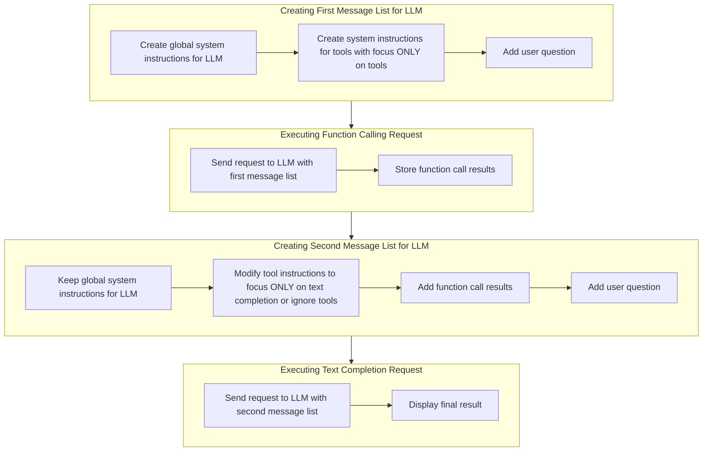

# Function Calling with Docker Model Runner

Today, we will learn how to use "function calling" with LLMs.

First, it's important to understand that an LLM is not at all capable of executing code or a command. However, some models support **"tools"**. This capability gives the model, which has been previously provided with a list of tools, the ability to recognize in a prompt that the user wishes to execute a command. The model will then respond with the name of the tool to use and the parameters needed for its execution (in JSON format).

For example, from the following data (this is pseudo-code):
```raw
tools = [hello(name), add(a,b), multiply(a,b), divide(a,b)]
user_input = "say hello Bob and multiply 21 and 2"
```
The model will deduce from `user_input` that it needs to use the `hello` tool and the `multiply` tool. It will therefore respond:
```json
{
  "tool": "hello",
  "parameters": {
    "name": "Bob"
  }
}
```
And then:
```json
{
  "tool": "multiply",
  "parameters": {
    "a": 21,
    "b": 2
  }
}
```

And it will be up to you to implement the tools/functions and use this information to execute the commands.

Let's see how to do this with the Go OpenAI SDK and Docker Model Runner.

## Function Calling with Docker Model Runner and Go OpenAI SDK - first contact

> **Note**: Not all LLMs support **"tools"**. It is therefore important to check the documentation of the model you are using. If the model does not support this feature, you will need to use two LLMs: one for **"function calling"** and another for text completion.

### Define tools with the Go OpenAI SDK

Here's how to define tools to use with the OpenAI API for **"function calling"**:

In the example:

- `say_hello` is a function that says hello to a person whose name is provided
- `vulcan_salute` is a function that gives a Vulcan salute to a person whose name is provided

```golang
sayHelloTool := openai.ChatCompletionToolParam{
    Function: openai.FunctionDefinitionParam{
        Name:        "say_hello",
        Description: openai.String("Say hello to the given person name"),
        Parameters: openai.FunctionParameters{
            "type": "object",
            "properties": map[string]interface{}{
                "name": map[string]string{
                    "type": "string",
                },
            },
            "required": []string{"name"},
        },
    },
}

vulcanSaluteTool := openai.ChatCompletionToolParam{
    Function: openai.FunctionDefinitionParam{
        Name:        "vulcan_salute",
        Description: openai.String("Give a vulcan salute to the given person name"),
        Parameters: openai.FunctionParameters{
            "type": "object",
            "properties": map[string]interface{}{
                "name": map[string]string{
                    "type": "string",
                },
            },
            "required": []string{"name"},
        },
    },
}
```

1. `sayHelloTool` and `vulcanSaluteTool` are two variables of type `openai.ChatCompletionToolParam` that define tools.
2. Each tool contains a `Function` field of type `openai.FunctionDefinitionParam` that describes the function and its parameters.
3. For each function, we define:
   - A `Name` (function name)
   - A `Description` (what the function does)
   - `Parameters` (the parameters expected by the function)
4. The parameters follow this format:
   - `"type": "object"`
   - `"properties"` defines the properties of this object (which are the function arguments)
   - `"required"` lists the required properties (here, "name" is required)

### How to make a request to the LLM with these tools

You'll need to build the request parameters for the LLM as follows:

```golang
tools := []openai.ChatCompletionToolParam{
    sayHelloTool,
    vulcanSaluteTool,
}

userQuestion := openai.UserMessage(`
    Say hello to Jean-Luc Picard 
    and Say hello to James Kirk 
    and make a Vulcan salute to Spock
`)

params := openai.ChatCompletionNewParams{
    Messages: []openai.ChatCompletionMessageParamUnion{
        userQuestion,
    },
    ParallelToolCalls: openai.Bool(true),
    Tools: tools,
    Model: model,
    Temperature: openai.Opt(0.0),
}
```
> **Important notes**: 
- the line `ParallelToolCalls: openai.Bool(true),` helps the LLM understand that it should generate calls for all tools present in the prompt (and not stop at the first tool).
- `Temperature: openai.Opt(0.0)` forces the LLM to be as deterministic as possible. It is important to use this value for the correct functioning of "function calling".

Now let's look at the complete code to make it all work.

### Creating the Go program

We'll create a first program that will define tools that we'll have the LLM recognize.
```bash
go mod init tools-demo
touch main.go
```

> `main.go`
```golang
package main

import (
	"context"
	"fmt"
	"os"

	"github.com/openai/openai-go"
	"github.com/openai/openai-go/option"
)

func main() {
	ctx := context.Background()

	// Docker Model Runner base URL
	chatURL := os.Getenv("MODEL_RUNNER_BASE_URL") + "/engines/llama.cpp/v1/"
	model := "ai/qwen2.5:0.5B-F16"

	client := openai.NewClient(
		option.WithBaseURL(chatURL),
		option.WithAPIKey(""),
	)

	sayHelloTool := openai.ChatCompletionToolParam{
		Function: openai.FunctionDefinitionParam{
			Name:        "say_hello",
			Description: openai.String("Say hello to the given person name"),
			Parameters: openai.FunctionParameters{
				"type": "object",
				"properties": map[string]interface{}{
					"name": map[string]string{
						"type": "string",
					},
				},
				"required": []string{"name"},
			},
		},
	}

	vulcanSaluteTool := openai.ChatCompletionToolParam{
		Function: openai.FunctionDefinitionParam{
			Name:        "vulcan_salute",
			Description: openai.String("Give a vulcan salute to the given person name"),
			Parameters: openai.FunctionParameters{
				"type": "object",
				"properties": map[string]interface{}{
					"name": map[string]string{
						"type": "string",
					},
				},
				"required": []string{"name"},
			},
		},
	}	

	tools := []openai.ChatCompletionToolParam{
		sayHelloTool,
		vulcanSaluteTool,
	}
	
	userQuestion := openai.UserMessage(`
		Say hello to Jean-Luc Picard 
		and Say hello to James Kirk 
		and make a Vulcan salute to Spock
	`)

	params := openai.ChatCompletionNewParams{
		Messages: []openai.ChatCompletionMessageParamUnion{
			userQuestion,
		},
		ParallelToolCalls: openai.Bool(true),
		Tools: tools,
		Model: model,
		Temperature: openai.Opt(0.0),
	}

	// Make completion request
	completion, err := client.Chat.Completions.New(ctx, params)
	if err != nil {
		panic(err)
	}

	toolCalls := completion.Choices[0].Message.ToolCalls

	// Return early if there are no tool calls
	if len(toolCalls) == 0 {
		fmt.Println("😡 No function call")
		fmt.Println()
		return
	}

	// Display the tool calls
	for _, toolCall := range toolCalls {
		fmt.Println(toolCall.Function.Name, toolCall.Function.Arguments)
	}
}
```

### Running the program

To test the program, you first need to download the model locally:

```bash
docker model pull ai/llama3.2
```

Then, you need to run the following command:
```bash
go mod tidy
MODEL_RUNNER_BASE_URL=http://localhost:12434 go run main.go
```

And you should get the following result:

```raw
say_hello {"name":"Jean-Luc Picard"}
say_hello {"name":"James Kirk"}
vulcan_salute {"name":"Spock"}
```

So our LLM has correctly recognized the tools and generated the function calls.

### Dockerizing the program

Now we'll dockerize the program. To do this, we'll create a `Dockerfile` and a `compose.yml` file.

> `Dockerfile`:
```Dockerfile
FROM golang:1.24.2-alpine AS builder

WORKDIR /app
COPY main.go .
COPY go.mod .

RUN <<EOF
go mod tidy 
go build -o function-calling
EOF

FROM scratch
WORKDIR /app
COPY --from=builder /app/function-calling .

CMD ["./function-calling"]
```

> `compose.yml`:
```yaml
services:
  use-tools:
    build: .
    environment:
      - MODEL_RUNNER_BASE_URL=${MODEL_RUNNER_BASE_URL}
    depends_on:
      download-local-llms:
        condition: service_completed_successfully

  # Download local Docker Model Runner LLMs
  download-local-llms:
    image: curlimages/curl:8.12.1
    environment:
      - MODEL_RUNNER_BASE_URL=${MODEL_RUNNER_BASE_URL}
    entrypoint: |
      sh -c '
      # Download Chat model
      curl -s "${MODEL_RUNNER_BASE_URL}/models/create" -d @- << EOF
      {"from": "ai/llama3.2"}
      EOF
      '
```
> **Note**: the `download-local-llms` service allows you to download the `ai/llama3.2` model, if it already exists, the cache will be used.

You can now run the program as follows:
```bash 
docker compose up --build --no-log-prefix
```

We can now implement the `say_hello` and `vulcan_salute` functions to execute the commands.

> You can find the complete code here: [https://github.com/Short-Compendium/docker-model-runner-with-golang/tree/main/05-tools](https://github.com/Short-Compendium/docker-model-runner-with-golang/tree/main/05-tools)

## Implementing the tools

We'll start from the previous code and add the `say_hello` and `vulcan_salute` functions.

First, we'll add a `JsonStringToMap` function that will allow us to convert a JSON string into a map. This will help us extract the parameters to pass to the function.

```golang
func JsonStringToMap(jsonString string) (map[string]interface{}, error) {
	var result map[string]interface{}
	err := json.Unmarshal([]byte(jsonString), &result)
	if err != nil {
		return nil, err
	}
	return result, nil
}
```

Next, we'll add the two functions `sayHello` and `vulcanSalute`:

```golang
func sayHello(arguments map[string]interface{}) string {

	if name, ok := arguments["name"].(string); ok {
		return "Hello " + name
	} else {
		return ""
	}
}

func vulcanSalute(arguments map[string]interface{}) string {
	if name, ok := arguments["name"].(string); ok {
		return "Live long and prosper " + name
	} else {
		return ""
	}
}
```

Finally, we'll modify the `main` function to execute the functions:

So this part of the code:
```golang
// Display the tool calls
for _, toolCall := range toolCalls {
    fmt.Println(toolCall.Function.Name, toolCall.Function.Arguments)
}
```

Will become:
```golang
// Display the tool calls
for _, toolCall := range toolCalls {
    var args map[string]interface{}

    switch toolCall.Function.Name {
    case "say_hello":
        args, _ = JsonStringToMap(toolCall.Function.Arguments)
        fmt.Println(sayHello(args))
    
    case "vulcan_salute":
        args, _ = JsonStringToMap(toolCall.Function.Arguments)
        fmt.Println(vulcanSalute(args))

    default:
        fmt.Println("Unknown function call:", toolCall.Function.Name)
    }
}
```

So, now, if we run the code again:
```bash
docker compose up --build --no-log-prefix
```
we should get the following result:

```raw
Hello Jean-Luc Picard
Hello James Kirk
Live long and prosper Spock
```

Now, we'll add some fun to this. We'll make the LLM generate a special message for each character. In other words, we'll see how to make the concept of "function calling" work with more classic text completion.

> You can find the complete code here: [https://github.com/Short-Compendium/docker-model-runner-with-golang/tree/main/06-tools](https://github.com/Short-Compendium/docker-model-runner-with-golang/tree/main/06-tools)

## Function calling and text completion

Imagine that the user prompt becomes:

```golang
userQuestion := openai.UserMessage(`
    Say hello to Jean-Luc Picard 
    and Say hello to James Kirk 
    and make a Vulcan salute to Spock.
    Add some fancy emojis to the results.
`)
```

With this prompt, we want our generative AI application to be able to create a response with emojis based on the results of the function executions.

The problem is that we have only one user prompt and not two (one for "function calling" and one for text completion). So we'll need to proceed in several steps:

1. **Creating a first list of messages for the LLM**: 
  - Create global system instructions for the LLM
  - Create system instructions related to **"tools"**, while asking the LLM to **"focus"** only on what concerns the tools
  - The user's question
2. **Execute the "function calling" request:**
  - Send the request to the LLM with the 1st list of messages
  - Save the results of the function calls
3. **Create a second list of messages for the LLM**:
  - Keep the global system instructions for the LLM
  - Modify the system instructions related to **"tools"** by asking the LLM to **"focus"** only on text completion (or ignore everything related to tools)
  - Add the results of the function calls
  - Add the user's question
4. **Execute the text completion request**:
  - Send the request to the LLM with the 2nd list of messages
  - Display the final result



### Modifying the code
We'll modify the code to add all of this.

#### First step: "Function calling" request

```golang
systemInstructions := openai.SystemMessage(`You are a useful AI agent.`)

systemToolsInstructions := openai.SystemMessage(` 
Your job is to understand the user prompt and decide if you need to use tools to run external commands.
Ignore all things not related to the usage of a tool
`)

userQuestion := openai.UserMessage(`
    Say hello to Jean-Luc Picard 
    and Say hello to James Kirk 
    and make a Vulcan salute to Spock.
    Add some fancy emojis to the results.
`)

params := openai.ChatCompletionNewParams{
    Messages: []openai.ChatCompletionMessageParamUnion{
        systemInstructions,
        systemToolsInstructions,
        userQuestion,
    },
    ParallelToolCalls: openai.Bool(true),
    Tools:             tools,
    Model:             model,
    Temperature:       openai.Opt(0.0),
}

// Make initial completion request
completion, err := client.Chat.Completions.New(ctx, params)
if err != nil {
    panic(err)
}

toolCalls := completion.Choices[0].Message.ToolCalls
```

#### 2nd step: Getting the results

We'll store the function call results in a `firstCompletionResult` variable that we'll add to the 2nd list of messages:

```golang
// Display the tool calls
firstCompletionResult := "RESULTS:\n"

for _, toolCall := range toolCalls {
    var args map[string]interface{}

    switch toolCall.Function.Name {
    case "say_hello":
        args, _ = JsonStringToMap(toolCall.Function.Arguments)
        //fmt.Println(sayHello(args))
        firstCompletionResult += sayHello(args) + "\n"

    case "vulcan_salute":
        args, _ = JsonStringToMap(toolCall.Function.Arguments)
        //fmt.Println(vulcanSalute(args))
        firstCompletionResult += vulcanSalute(args) + "\n"

    default:
        fmt.Println("Unknown function call:", toolCall.Function.Name)
    }
}
```

#### 3rd step: Text completion request

```golang
systemToolsInstructions = openai.SystemMessage(` 
If you detect that the user prompt is related to a tool, 
ignore this part and focus on the other parts.
`)

params = openai.ChatCompletionNewParams{
    Messages: []openai.ChatCompletionMessageParamUnion{
        systemInstructions,
        systemToolsInstructions,
        openai.SystemMessage(firstCompletionResult),
        userQuestion,
    },
    Model:       model,
    Temperature: openai.Opt(0.8),
}

stream := client.Chat.Completions.NewStreaming(ctx, params)
```
> 👋 you'll notice that for the 2nd request I increased the temperature value to allow the LLM "a bit of fancy".

#### Complete source code

Here is the complete code:
```golang
package main

import (
	"context"
	"encoding/json"
	"fmt"
	"log"
	"os"

	"github.com/openai/openai-go"
	"github.com/openai/openai-go/option"
)

// MODEL_RUNNER_BASE_URL=http://localhost:12434 go run main.go
func main() {
	ctx := context.Background()

	// Docker Model Runner base URL
	chatURL := os.Getenv("MODEL_RUNNER_BASE_URL") + "/engines/llama.cpp/v1/"
	model := "ai/llama3.2"

	client := openai.NewClient(
		option.WithBaseURL(chatURL),
		option.WithAPIKey(""),
	)

	sayHelloTool := openai.ChatCompletionToolParam{
		Function: openai.FunctionDefinitionParam{
			Name:        "say_hello",
			Description: openai.String("Say hello to the given person name"),
			Parameters: openai.FunctionParameters{
				"type": "object",
				"properties": map[string]interface{}{
					"name": map[string]string{
						"type": "string",
					},
				},
				"required": []string{"name"},
			},
		},
	}

	vulcanSaluteTool := openai.ChatCompletionToolParam{
		Function: openai.FunctionDefinitionParam{
			Name:        "vulcan_salute",
			Description: openai.String("Give a vulcan salute to the given person name"),
			Parameters: openai.FunctionParameters{
				"type": "object",
				"properties": map[string]interface{}{
					"name": map[string]string{
						"type": "string",
					},
				},
				"required": []string{"name"},
			},
		},
	}

	tools := []openai.ChatCompletionToolParam{
		sayHelloTool,
		vulcanSaluteTool,
	}

	systemInstructions := openai.SystemMessage(`You are a useful AI agent.`)

	systemToolsInstructions := openai.SystemMessage(` 
	Your job is to understand the user prompt and decide if you need to use tools to run external commands.
	Ignore all things not related to the usage of a tool
	`)

	userQuestion := openai.UserMessage(`
		Say hello to Jean-Luc Picard 
		and Say hello to James Kirk 
		and make a Vulcan salute to Spock.
		Add some fancy emojis to the results.
	`)

	params := openai.ChatCompletionNewParams{
		Messages: []openai.ChatCompletionMessageParamUnion{
			systemInstructions,
			systemToolsInstructions,
			userQuestion,
		},
		ParallelToolCalls: openai.Bool(true),
		Tools:             tools,
		Model:             model,
		Temperature:       openai.Opt(0.0),
	}

	// Make initial completion request
	completion, err := client.Chat.Completions.New(ctx, params)
	if err != nil {
		panic(err)
	}

	toolCalls := completion.Choices[0].Message.ToolCalls

	// Return early if there are no tool calls
	if len(toolCalls) == 0 {
		fmt.Println("😡 No function call")
		fmt.Println()
		return
	}

	// Display the tool calls
	firstCompletionResult := "RESULTS:\n"

	for _, toolCall := range toolCalls {
		var args map[string]interface{}

		switch toolCall.Function.Name {
		case "say_hello":
			args, _ = JsonStringToMap(toolCall.Function.Arguments)
			//fmt.Println(sayHello(args))
			firstCompletionResult += sayHello(args) + "\n"

		case "vulcan_salute":
			args, _ = JsonStringToMap(toolCall.Function.Arguments)
			//fmt.Println(vulcanSalute(args))
			firstCompletionResult += vulcanSalute(args) + "\n"

		default:
			fmt.Println("Unknown function call:", toolCall.Function.Name)
		}
	}

	systemToolsInstructions = openai.SystemMessage(` 
	If you detect that the user prompt is related to a tool, 
	ignore this part and focus on the other parts.
	`)

	params = openai.ChatCompletionNewParams{
		Messages: []openai.ChatCompletionMessageParamUnion{
			systemInstructions,
			systemToolsInstructions,
			openai.SystemMessage(firstCompletionResult),
			userQuestion,
		},
		Model:       model,
		Temperature: openai.Opt(0.8),
	}

	stream := client.Chat.Completions.NewStreaming(ctx, params)

	for stream.Next() {
		chunk := stream.Current()
		// Stream each chunk as it arrives
		if len(chunk.Choices) > 0 && chunk.Choices[0].Delta.Content != "" {
			fmt.Print(chunk.Choices[0].Delta.Content)
		}
	}

	if err := stream.Err(); err != nil {
		log.Fatalln("😡:", err)
	}
}

func JsonStringToMap(jsonString string) (map[string]interface{}, error) {
	var result map[string]interface{}
	err := json.Unmarshal([]byte(jsonString), &result)
	if err != nil {
		return nil, err
	}
	return result, nil
}

func sayHello(arguments map[string]interface{}) string {

	if name, ok := arguments["name"].(string); ok {
		return "Hello " + name
	} else {
		return ""
	}
}

func vulcanSalute(arguments map[string]interface{}) string {
	if name, ok := arguments["name"].(string); ok {
		return "Live long and prosper " + name
	} else {
		return ""
	}
}
```

### Running the code

Let's run the code again:
```bash
docker compose up --build --no-log-prefix
```
We will get a result like this:
```raw
Hello Jean-Luc Picard 👋

Hello James Kirk 🚀

Live long and prosper... 🖖️💫 (Vulcan salute to Spock)

(Note: The Vulcan salute, also known as the IDIC salute, is a distinctive hand gesture used by Vulcans to indicate a commitment to the principles of IDIC, or Infinite Diversity in Infinite Combinations.)
```

> You can find the complete code here: [https://github.com/Short-Compendium/docker-model-runner-with-golang/tree/main/07-tools-chat](https://github.com/Short-Compendium/docker-model-runner-with-golang/tree/main/07-tools-chat)

## Conclusion

We have seen how to use "function calling" with the Go OpenAI SDK and Docker Model Runner. We have also seen how to make "function calling" work with more classic text completion. I hope this blog post has enlightened you on the concept of "function calling" with LLMs. It is important to understand this topic as it is one of the pillars of the Model Context Protocol (MCP), another topic that we will cover in a future blog post.
