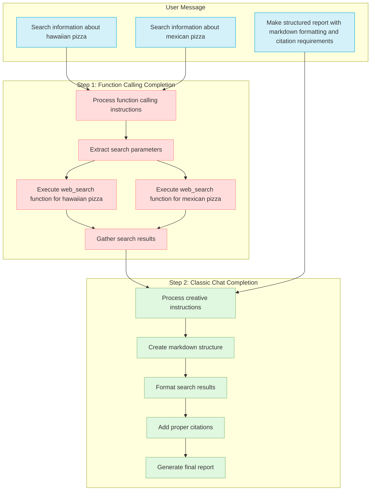
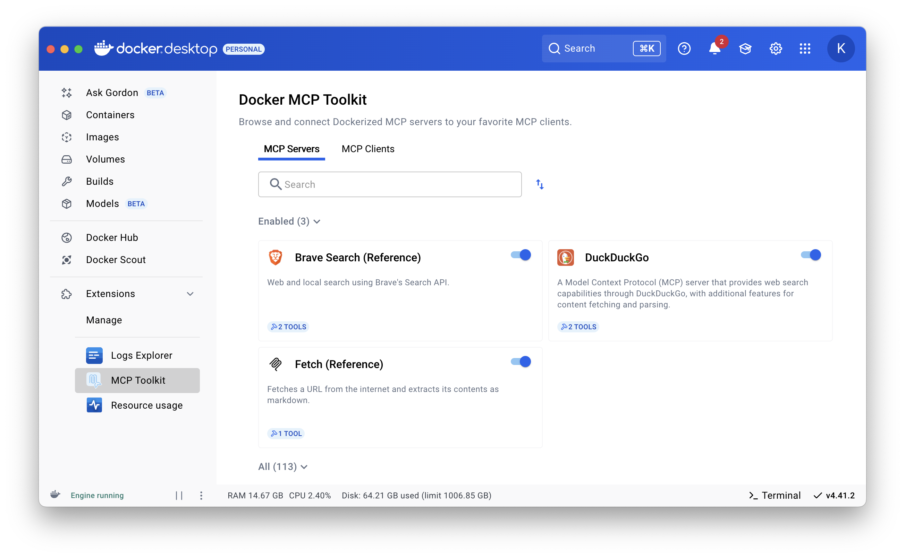
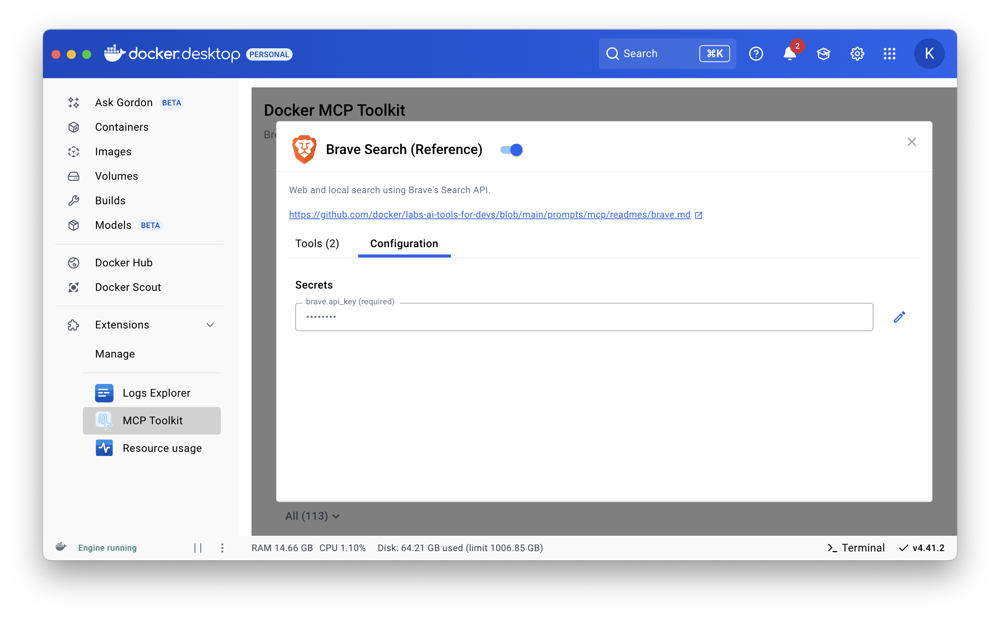
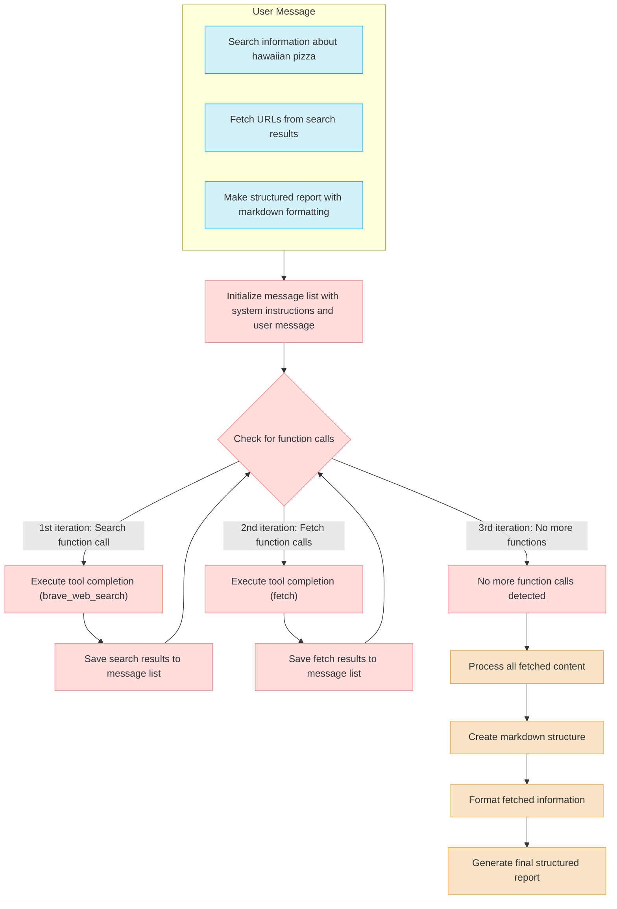

# Hybrid Prompts with Docker Model Runner and the MCP Toolkit
> Let's go a bit further in using "function calling" and create more complex prompts.

In the previous article, we saw how to do "function calling" using Docker Model Runner and the Docker MCP Toolkit: ["Boosting Docker Model Runner with Docker MCP Toolkit"](https://k33g.hashnode.dev/boosting-docker-model-runner-with-docker-mcp-toolkit).

The user message used to build the prompt was extremely simple:

```text
Search information about hawaiian pizza.(only 3 results)"
```

And the [implementation](https://k33g.hashnode.dev/boosting-docker-model-runner-with-docker-mcp-toolkit#heading-making-the-llm-recognize-the-will-to-call-a-tool) was simple:

```golang
// Create a list of messages for the chat completion request
messages := []openai.ChatCompletionMessageParamUnion{
    openai.SystemMessage("You are a pizza expert."),
    openai.UserMessage("Search information about hawaiian pizza.(only 3 results)"),
}
// Create the chat completion parameters
params := openai.ChatCompletionNewParams{
    Messages:          messages,
    ParallelToolCalls: openai.Bool(true),
    Tools:             openAITools,
    Model:             model,
    Temperature:       openai.Opt(0.0),
}
// Make initial chat completion request
completion, err := dmrClient.Chat.Completions.New(ctx, params)
// ...
detectedToolCalls := completion.Choices[0].Message.ToolCalls

// Tools execution
for _, toolCall := range detectedToolCalls {
    fmt.Println("📣 calling ", toolCall.Function.Name, toolCall.Function.Arguments)

    var args map[string]any
    err = json.Unmarshal([]byte(toolCall.Function.Arguments), &args)
    // ...
    // Call the tool with the arguments
    toolResponse, err := mcpClient.CallTool(ctx, toolCall.Function.Name, args)
    // ...
    fmt.Println("🎉📝 Tool response:", toolResponse.Content[0].TextContent.Text)
}
```

But how would we handle a more complicated prompt?

## Structured Search Hybrid Prompt
> I'm not sure if this is what it's actually called, but I needed a title for this section.

Imagine the following user message:

```text
Search information about hawaiian pizza.(only 3 results)

Search information about mexican pizza.(only 3 results)
        
Make a structured report with all the results,
Make sure to include the source of the information.
The output format MUST be in markdown.
```

This type of prompt combines several distinct elements:

1. Search instructions with specific parameters (multiple searches limited to 3 results each)
2. Formatting and presentation instructions (markdown)
3. Guidelines on the content and structure of the final report
4. Instructions for citing sources

This prompt leverages both "function calling" capabilities (parameterized search calls) and more classic "creative" instructions for formatting and presenting the results.

We have created a complete workflow: search → data processing → structured presentation, all in a single instruction.

But from a code perspective, how do we implement it?

To explain it simply, we'll use the **same user message** in two successive completions:

- A "function calling" type completion
- A "classic (chat)" type completion, first adding the results of the first completion to the message list.



### Prerequisites

#### MCP Servers

In the previous article, I used the DuckDuckGo MCP server. This time I'll use two different MCP servers:

- **Brave Search**: allows searching the internet
- **Fetch**: allows retrieving the content of a web page
> The DuckDuckGo MCP server offers these functionalities by itself, but I wanted to test with multiple servers.

For the **Brave Search** MCP server, the tool name is `brave_web_search`, and for the **Fetch** MCP server, it's `fetch`. I'll use these names to filter the list of tools to provide to the LLM.



To do web searches with the **Brave Search** MCP server, you'll need an API key. **Brave** offers a free plan that's more than enough for our experiments [https://brave.com/search/api/](https://brave.com/search/api/) (1 query/second, up to 2,000 queries/month)



#### The LLM(s)

For the following examples, I'll use the `ai/qwen2.5:latest` model for both "function calling" and the more "classic" final completion. But you could also use different models like `ai/qwen3:latest`.
> FYI: the message aggregation technique I use to provide function call results for the final completion seems to only work with `qwen` type models - *I'm thinking about a workaround solution*.

#### Helpers

To make the code a bit more readable, I created two "helpers":

- Create an MCP client: `func GetMCPClient(ctx context.Context) (*mcp_golang.Client, *exec.Cmd, error)`
- Transform the list of MCP tools into OpenAI format tools: `ConvertToOpenAITools(tools []mcp_golang.ToolRetType) []openai.ChatCompletionToolParam`

Now we're ready for the code part.

## Implementation of the Structured Search Hybrid Prompt

I start by defining the model(s) used, creating a client to connect to Docker Model Runner, and preparing the prompt messages:

```golang
ctx := context.Background()

// Docker Model Runner base URL
chatURL := os.Getenv("MODEL_RUNNER_BASE_URL") + "/engines/llama.cpp/v1/"
modelTools := os.Getenv("MODEL_RUNNER_LLM_TOOLS")
modelChat := os.Getenv("MODEL_RUNNER_LLM_CHAT")

// Create a new OpenAI client
dmrClient := openai.NewClient(
    option.WithBaseURL(chatURL),
    option.WithAPIKey(""),
)

systemInstructions := `You are a pizza expert.`
userQuestion := `
    Search information about hawaiian pizza.(only 3 results)

    Search information about mexican pizza.(only 3 results)
            
    Make a structured report with all the results,
    Make sure to include the source of the information.
    The output format MUST be in markdown.
`
```
> I defined the environment variables in a `.env` file
> - `MODEL_RUNNER_BASE_URL=http://model-runner.docker.internal`
> - `MODEL_RUNNER_LLM_TOOLS=ai/qwen2.5:latest`
> - `MODEL_RUNNER_LLM_CHAT=ai/qwen2.5:latest`

Next, I create an MCP client to connect to the MCP server and get the list of available tools:
```golang
// Create a new MCP client
mcpClient, cmd, err := GetMCPClient(ctx)

if err != nil {
    log.Fatalf("😡 Failed to create MCP client: %v", err)
}
defer cmd.Process.Kill()

// Get the list of the available MCP tools
mcpTools, err := mcpClient.ListTools(ctx, nil)
if err != nil {
    log.Fatalf("😡 Failed to list tools: %v", err)
}

fmt.Println("🛠️  Available Tools (MCP format): ", len(mcpTools.Tools))

```
> I use the [mcp_golang](github.com/metoro-io/mcp-golang") framework to connect to the MCP server.

Then I'll filter the list of tools obtained (this guarantees that the LLM will only use these, and it will make it easier for the LLM to search for tools for function calling) and convert them into a format readable by the OpenAI Go SDK:
```golang
filteredTools := []mcp_golang.ToolRetType{}
for _, tool := range mcpTools.Tools {
    if tool.Name == "brave_web_search" || tool.Name == "fetch" { //|| tool.Name == "fetch"
        filteredTools = append(filteredTools, tool)
    }
}

fmt.Println("⏳ Converting tools to OpenAI format...")
// Convert the mcp tools to openai tools
openAITools := ConvertToOpenAITools(filteredTools)
```

I can now create the tool completion parameters, prepare the list of **prompt messages**, and launch the request:
```golang
// Create a list of messages for the chat completion request
messages := []openai.ChatCompletionMessageParamUnion{
    openai.SystemMessage(systemInstructions),
    openai.UserMessage(userQuestion),
}

// Create the chat completion parameters
params := openai.ChatCompletionNewParams{
    Messages:          messages,
    ParallelToolCalls: openai.Bool(true),
    Tools:             openAITools,
    Seed:              openai.Int(0),
    Model:             modelTools,
    Temperature:       openai.Opt(0.0),
}

// Make initial chat completion request to detect the tools
completion, err := dmrClient.Chat.Completions.New(ctx, params)
if err != nil {
    log.Fatalln("😡", err)
}

// Check if the completion contains any tool calls
detectedToolCalls := completion.Choices[0].Message.ToolCalls

if len(detectedToolCalls) == 0 {
    fmt.Println("😡 No function call")
    return
}

fmt.Println("\n🎉 Detected calls:", len(detectedToolCalls))
```

Once the tool call detections have been made, I can execute these calls (using the MCP client) by iterating through the list. **And with each call, I'll add the result to the prompt message list** using an `openai.ToolMessage` type message:
```golang
for _, toolCall := range detectedToolCalls {
    fmt.Println("📣 calling ", toolCall.Function.Name, toolCall.Function.Arguments)

    // toolCall.Function.Arguments is a JSON String
    // Convert the JSON string to a (map[string]any)
    var args map[string]any
    err = json.Unmarshal([]byte(toolCall.Function.Arguments), &args)
    if err != nil {
        log.Println("😡 Failed to unmarshal arguments:", err)
    }

    // Call the tool with the arguments
    toolResponse, err := mcpClient.CallTool(ctx, toolCall.Function.Name, args)
    if err != nil {
        log.Println("😡 Failed to call tool:", err)
    }
    if toolResponse != nil && len(toolResponse.Content) > 0 && toolResponse.Content[0].TextContent != nil {
        // Display the result
        fmt.Println("📝 Tool response:", toolResponse.Content[0].TextContent.Text)

        // ✋✋✋ Save the result to the list of messages
        messages = append(
            messages,
            openai.ToolMessage(
                toolResponse.Content[0].TextContent.Text,
                toolCall.ID,
            ),
        )

    }
}
fmt.Println("🎉 tools execution completed.")
```

Now that the tools have been executed and the results saved, I can launch the second and final completion:
```golang
params = openai.ChatCompletionNewParams{
    Messages:    messages,
    Model:       modelChat,
    Temperature: openai.Opt(0.9),
}

stream := dmrClient.Chat.Completions.NewStreaming(ctx, params)

for stream.Next() {
    chunk := stream.Current()
    // Stream each chunk as it arrives
    if len(chunk.Choices) > 0 && chunk.Choices[0].Delta.Content != "" {
        fmt.Print(chunk.Choices[0].Delta.Content)
    }
}
```
> So for the request parameters, I use the same list of messages completed with the list of tool execution results. I can also use a temperature `>0` to "free the creativity of the LLM".

The complete source code is available here: [https://github.com/Short-Compendium/docker-model-runner-with-golang/tree/main/16-use-mcp-toolkit](https://github.com/Short-Compendium/docker-model-runner-with-golang/tree/main/16-use-mcp-toolkit)

Now all we need to do is launch the application. For this, we'll Dockerize it.

### Dockerization and Execution

For this, I need a `.env` file, a `Dockerfile`, and a `compose.yml` file:

**`.env`**:
```bash
MODEL_RUNNER_BASE_URL=http://model-runner.docker.internal
MODEL_RUNNER_LLM_TOOLS=ai/qwen2.5:latest
MODEL_RUNNER_LLM_CHAT=ai/qwen2.5:latest
```

**`Dockerfile`**:
```Dockerfile
FROM golang:1.24.2-alpine AS builder

WORKDIR /app
COPY main.go .
COPY go.mod .

RUN <<EOF
go mod tidy
go build -o use-mcp-toolkit
EOF

FROM alpine:3.19
WORKDIR /app

# Install socat
RUN apk add --no-cache socat

COPY --from=builder /app/use-mcp-toolkit .

CMD ["./use-mcp-toolkit"]
```
> `socat` is the utility that allows the MCP client in my code to connect to the Docker MCP Toolkit with the command `socat STDIO TCP:host.docker.internal:8811` (see the code of the `GetMCPClient` helper)

**`compose.yml`**:
```yaml
services:
  use-mcp-toolkit-in-chat:
    build: .
    environment:
      - MODEL_RUNNER_BASE_URL=${MODEL_RUNNER_BASE_URL}
      - MODEL_RUNNER_LLM_CHAT=${MODEL_RUNNER_LLM_CHAT}
      - MODEL_RUNNER_LLM_TOOLS=${MODEL_RUNNER_LLM_TOOLS}
    depends_on:
      - llm-chat
      - llm-tools

  # Download local Docker Model Runner LLMs
  llm-chat:
   provider:
     type: model
     options:
       model: ${MODEL_RUNNER_LLM_CHAT}

  llm-tools:
   provider:
     type: model
     options:
       model: ${MODEL_RUNNER_LLM_TOOLS}

```

Then, all you need to do is run the following command:
```
docker compose up --build --no-log-prefix
```

And wait a bit to get your markdown report on Hawaiian and Mexican pizzas:

```markdown
# Hawaiian Pizza

## Overview
- **Description**: Hawaiian pizza is a pizza invented in Canada, topped with pineapple, tomato sauce, mozzarella cheese, and either ham or bacon.
- **Origin**: Created by Sam Panopoulos, a Greek-born Canadian, at the Satellite Restaurant in Chatham-Kent, Ontario, Canada, in 1962.
- **Source**: [Wikipedia](https://en.wikipedia.org/wiki/Hawaiian_pizza)

## Recipes
1. **Classic Hawaiian Pizza** - Combines cheese, cooked ham, pineapple, and bacon. Also features a homemade pizza crust.  
   - **Source**: [Sally's Baking Addiction](https://sallysbakingaddiction.com/hawaiian-pizza/)
2. **Easy Hawaiian Pizza** - Uses fresh pineapples, ham, and oregano for a homemade version.  
   - **Source**: [Cooking For My Soul](https://cookingformysoul.com/hawaiian-pizza/)

---

# Mexican Pizza

## Overview
- **Description**: Mexican pizzas are easy to make and can be a good alternative to Taco Tuesday. Common toppings include layers of salsa, Monterey Jack and Cheddar cheeses, tomatoes, green onion, and jalapeño slices.
- **Source**: [Taco Bell®](https://www.tacobell.com/food/specialties/mexican-pizza), [All Recipes](https://www.allrecipes.com/recipe/53075/jimmys-mexican-pizza/)

## Recipes
1. **Easy Mexican Pizza** - A Taco Bell Copy Cat recipe featuring layers of salsa, Monterey Jack and Cheddar cheeses, tomatoes, green onion, and jalapeño slices.  
   - **Source**: [Cooking in the Midwest](https://cookinginthemidwest.com/blog/easy-mexican-pizza/)
2. **Jimmys Mexican Pizza** - A homemade version featuring the same toppings as the Taco Bell version.  
   - **Source**: [All Recipes](https://www.allrecipes.com/recipe/53075/jimmys-mexican-pizza/)

This structured report provides an overview of Hawaiian and Mexican pizzas, including their origins and some popular recipes. The information is sourced from credible websites such as Wikipedia, Sally's Baking Addiction, Cooking For My Soul, Cooking in the Midwest, Taco Bell, and All Recipes.
```

> ✋ this type of prompt is resource-intensive, so in some cases and depending on the number and types of tools used, the workflow execution can be lengthy.

You see, including "function calling" in a generative AI workflow isn't that complicated. But how would we do it if executing a tool required parameters from the results of a previously executed tool? 🤔

## Sequential Prompt with Tool Chaining
> Again, I don't know if this term actually exists, but I needed a title 🙂

This time, my user message will look like this:

```text
Search information about hawaiian pizza.(only 3 results)

Then fetch the URLs from the search information results.

Make a structured detailed report with all the results,
The output format MUST be in markdown.
```

So, this gets trickier, because this time, I'll first execute a search tool (`brave_web_search`), and then I'd like to execute a web page retrieval tool (`fetch`), using the URLs returned by `brave_web_search`. And finally, I'll create a report based on the information obtained.

Since I don't have these results in advance, this time I'll proceed in a slightly different way than in the previous case:

- I'll initialize my message list with system instructions and the user message.
- Then I'll create a function (or a closure) that will be responsible for detecting tool calls, executing them by executing the tools completion based on the message list, and finally saving the results in this same message list.
- And, this is the important point, I'll execute this function "in a loop" until I no longer detect any function calls to make.
- And at the end, I'll use the results to create a report.



## Implementation of the Sequential Prompt with Tool Chaining

For simplicity and readability, I'll only provide the modified parts, but the complete code is available here: [https://github.com/Short-Compendium/docker-model-runner-with-golang/tree/main/17-use-mcp-toolkit-with-tools-chain](https://github.com/Short-Compendium/docker-model-runner-with-golang/tree/main/17-use-mcp-toolkit-with-tools-chain)

So once my list of MCP tools is obtained and converted to the OpenAI format, I can initialize a list of messages to build my prompt:
```golang
systemInstructions := `You are a pizza expert.`
userQuestion := `
    Search information about hawaiian pizza.(only 3 results)

    Then fetch the URLs from the search information results.

    Make a structured detailed report with all the results,
    The output format MUST be in markdown.
`

// Create a list of messages for the tools and chat completion requests
messages := []openai.ChatCompletionMessageParamUnion{
    openai.SystemMessage(systemInstructions),
    openai.SystemMessage("Focus only on the part of the text that is related to tools to call."),
    openai.UserMessage(userQuestion),
}
```
> I added the following system message: `"Focus only on the part of the text that is related to tools to call."` because each time we add results to the prompt message list, it increases the size of the prompt and the LLM can "have trouble focusing".

Next, I define the function that will execute the tool completions, make calls to the MCP server to execute the tools, and save the results:

```golang
DetectToolThenCallIt := func() bool {
    // Create the chat completion parameters
    params := openai.ChatCompletionNewParams{
        Messages:          messages,
        ParallelToolCalls: openai.Bool(true),
        Tools:             openAITools, 
        Seed:              openai.Int(0),
        Model:             modelTools,
        Temperature:       openai.Opt(0.0),
    }

    // Make initial chat completion request to detect the tools
    completion, err := dmrClient.Chat.Completions.New(ctx, params)
    if err != nil {
        log.Println("🛠️😡", err)
        return false
    }

    // Check if the completion contains any tool calls
    detectedToolCalls := completion.Choices[0].Message.ToolCalls

    // Exit if no tool calls are detected
    if len(detectedToolCalls) == 0 {
        fmt.Println("👋 No function call")
        return false
    }

    fmt.Println("\n✋ Detected calls:", len(detectedToolCalls))

    toolMessages := make([]openai.ChatCompletionMessageParamUnion, 0, len(detectedToolCalls))
    for _, toolCall := range detectedToolCalls {
        // Call the tool with the arguments
        var args map[string]any
        _ = json.Unmarshal([]byte(toolCall.Function.Arguments), &args)

        fmt.Println("📣 calling ", toolCall.Function.Name, toolCall.Function.Arguments)

        // Call the tool with the arguments
        toolResponse, err := mcpClient.CallTool(ctx, toolCall.Function.Name, args)
        if err != nil {
            log.Println("❌😡 Failed to call tool:", err)
            continue
        }

        // Create a proper tool response message
        toolMessages = append(
            toolMessages,
            openai.ToolMessage(
                toolResponse.Content[0].TextContent.Text,
                toolCall.ID,
            ),
        )

        fmt.Println("📝 Tool response:\n", toolResponse.Content[0].TextContent.Text)
    }

    // Add all tool messages at once
    messages = append(messages, toolMessages...)

    return true
}
```
> Using the `openai.ToolMessage` type message with its `ID` in the message history allows the model to "know" that it has called the tool.

And then I can execute my function in a loop:
```golang
// Loop until all tools are called
pass := 1
for DetectToolThenCallIt() {
    fmt.Println("✅ Pass number", pass, "of tool calls executed.")
    pass++
}
fmt.Println("🎉 tools execution completed.")
```

Finally, executing the last completion to generate the report from the obtained results:
```golang
params := openai.ChatCompletionNewParams{
    Messages:    messages,
    Model:       modelChat,
    Temperature: openai.Opt(0.9),
}

stream := dmrClient.Chat.Completions.NewStreaming(ctx, params)

for stream.Next() {
    chunk := stream.Current()
    // Stream each chunk as it arrives
    if len(chunk.Choices) > 0 && chunk.Choices[0].Delta.Content != "" {
        fmt.Print(chunk.Choices[0].Delta.Content)
    }
}
```

**✋ Important note:** the processing will be long, because each time you increase the prompt with new messages to perform the tools completion, the LLM will relaunch a detection on all the content.

To speed up the example a bit, since we know that the tools we need will be executed during the first 2 calls of `DetectToolThenCallIt()`, we can modify the code as follows to avoid a 3rd detection pass (which wouldn't find any more tools to execute anyway):

```golang
// Loop until all tools are called
pass := 1
for DetectToolThenCallIt() {
    fmt.Println("✅ Pass number", pass, "of tool calls executed.")
    pass++
    // to avoid too long and useless searches
    if pass > 2 {
        break
    }
}
```

All that's left is to launch our application again with the following command:
```
docker compose up --build --no-log-prefix
```

✋✋✋ **Important note**: This time, for "function calling", I used `ai/qwen3:latest` which I found better than `ai/qwen2.5:latest` in this context of "tool call chaining":

**`.env`**:
```bash
MODEL_RUNNER_LLM_TOOLS=ai/qwen3:latest
MODEL_RUNNER_LLM_CHAT=ai/qwen2.5:latest
```

And wait a little while ⏳... To get a result like this:

```markdown
# Hawaiian Pizza Results

## 1. Wikipedia
- **Title:** Hawaiian pizza - Wikipedia
- **Description:** Hawaiian pizza is a pizza invented in Canada, topped with pineapple, tomato sauce, mozzarella cheese, and either ham or bacon. Sam Panopoulos, a Greek-born Canadian, created the first Hawaiian pizza at the Satellite Restaurant in Chatham-Kent, Ontario, Canada, in 1962.
- **URL:** [Wikipedia - Hawaiian Pizza](https://en.wikipedia.org/wiki/Hawaiian_pizza)

## 2. Sally's Baking Addiction
- **Title:** Hawaiian Pizza - Sally's Baking Addiction
- **Description:** Classic Hawaiian Pizza combines cheese, cooked ham, pineapple, and bacon. To take your pizza to the next level, use this homemade pizza crust!
- **URL:** [Sally's Baking Addiction - Hawaiian Pizza](https://sallysbakingaddiction.com/hawaiian-pizza/)

## 3. Cooking For My Soul
- **Title:** Easy Hawaiian Pizza - Cooking For My Soul
- **Description:** This cheesy and delicious homemade Hawaiian pizza is so easy to make at home. Made with fresh pineapples, ham, and oregano!
- **URL:** [Cooking For My Soul - Hawaiian Pizza](https://cookingformysoul.com/hawaiian-pizza/)

This report includes the titles, descriptions, and URLs of the search results.
```

And that's it for today. To conclude, I'd say that this type of prompt is really resource-intensive, and ChatGPT or ClaudeAI would be much better for this kind of task. So if you need this sort of thing with local models, think through your implementation carefully. For example, if you know in advance how the tool calls will be made, and if the user experience allows it, split your prompts and do a tools completion for each of them:

```golang
messages := []openai.ChatCompletionMessageParamUnion{
    openai.UserMessage("Search information about hawaiian pizza.(only 3 results)"),
}

completion, err := dmrClient.Chat.Completions.New(ctx, params)
// ... make the tool calls
result1 := "content of the tools execution"

messages = []openai.ChatCompletionMessageParamUnion{
	openai.SystemMessage(result1),
    openai.UserMessage("Fetch the URLs from the search information results."),
}
params.Messages = messages
completion, err := dmrClient.Chat.Completions.New(ctx, params)
```
This will greatly accelerate the response time, but at the expense of the magical aspect of doing everything from a single user message.

If you have any advice on this topic, feel free to leave a comment.
