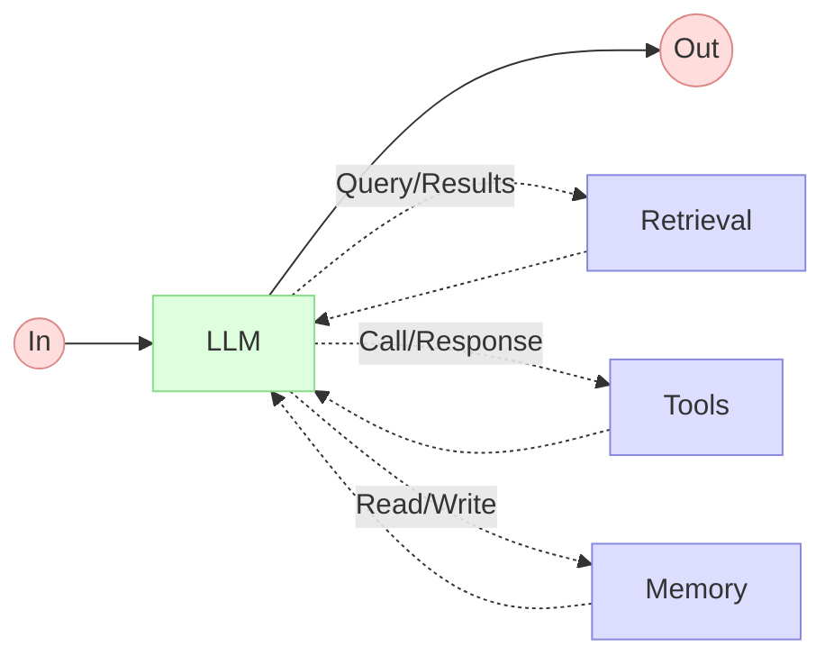
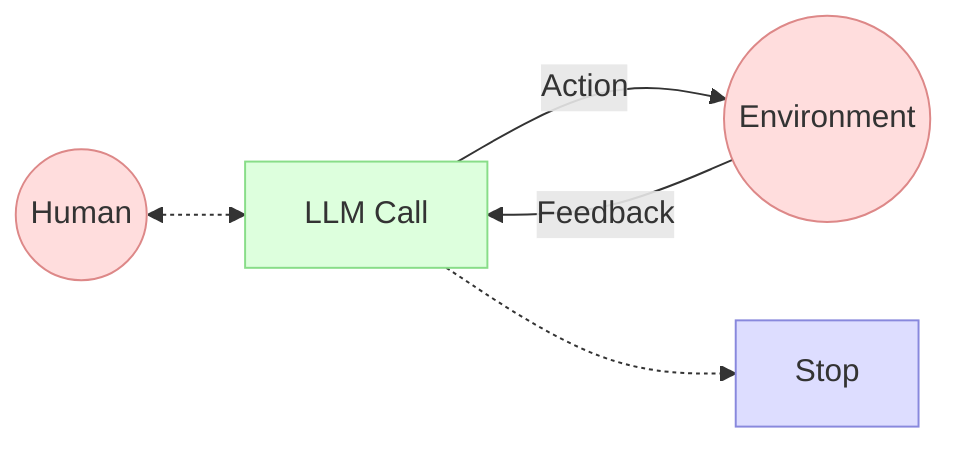

# Minimalist Implementation of an AI Agent with Docker Model Runner and Docker MCP Toolkit
> An AI Agent is ultimately just a pattern

> Disclaimer: this is an experiment and I'm not perfect, so the code examples may be improved in the future.

If you research to find the definition of an AI Agent, you'll find numerous definitions. Each definition gives more or less "powers" to the agent. I really like **[Anthropic](https://www.anthropic.com)**'s definition or vision on this subject with this article: [Building effective agents](https://www.anthropic.com/engineering/building-effective-agents). I'll try to summarize it:

The fundamental basis of an agentive system is a LLM augmented with capabilities like information retrieval, tool use, and memory. Anthropic clearly distinguishes **"workflows"** (systems where LLMs follow predefined paths) from true **"agents"** that "dynamically" direct their own processes. The most effective agents are generally not based on complex frameworks but on **simple, composable patterns**, essentially functioning as LLMs using tools based on feedback from the environment in an interaction loop.

For this 2-part article, I'll use what I described in previous blog posts in this series and with OpenAI's Go SDK, Docker Model Runner, and Docker MCP Toolkit, I'll implement a **minimal AI Agent implementation** inspired by Anthropic's definitions.

Ready?

## Part 1: The Augmented LLM

Let's start with the basic building block: "the augmented LLM"

Here's how:



Let's first set up the essential starting point: the connection to the LLM and chat completion.
> I'll call my new project **Robby** (📝: [Robby from Forbidden Planet](https://en.wikipedia.org/wiki/Robby_the_Robot))

### Chat Completion or Retrieval

#### 1. General Structure

```go
package robby

import (
	"context"
	"errors"

	"github.com/openai/openai-go"
	"github.com/openai/openai-go/option"
)
```

This code section defines a package named `robby` representing an AI agent library. The imports notably include `openai-go`, the official client for interacting with OpenAI APIs and thus with **Docker Model Runner** since it's compliant with this API.

#### 2. Agent Definition

```go
type Agent struct {
	ctx       context.Context
	dmrClient openai.Client
	Params    openai.ChatCompletionNewParams

	lastError error
}
```

##### Agent Structure

This structure represents the agent's state with:

- **`ctx` (context.Context)**: Controls the lifecycle of operations and cancellation propagation
- **`dmrClient` (openai.Client)**: Client to communicate with **Docker Model Runner** and a **LLM**
- **`Params` (openai.ChatCompletionNewParams)**: Configuration for **LLM** requests
- **`lastError` (error)**: Internal mechanism to propagate errors during configuration

Here are the two points that guided my implementation choices:

- I'll stick to a **Minimalist Architecture**: The agent is designed as a thin abstraction layer on the language model API
- I've tried and will try to respect as much as possible the **Separation of concerns**: Configuration vs execution

#### 3. Functional Options Pattern

```go
type AgentOption func(*Agent)
```

##### Definition and Usage

This pattern is a Go idiom for configuring objects flexibly and having scalable source code:

1. Define a function type that accepts and modifies the object
2. Functions return these options configured according to needs
3. The developer can compose the options they want to apply

##### Pattern Advantages

- **Fluid API**: Enables readable and chainable configuration
- **Extensibility**: Easy to add new options without modifying existing signatures
- **Implicit Default Values**: Only necessary options are specified
- **Partial Configuration**: Options can be stored and reused

#### 4. Specific Options

##### Connection to the Language Model (LLM)

```go
func WithDMRClient(ctx context.Context, baseURL string) AgentOption {
	return func(agent *Agent) {
		agent.ctx = ctx
		agent.dmrClient = openai.NewClient(
			option.WithBaseURL(baseURL),
			option.WithAPIKey(""),
		)
	}
}
```

This option configures:
- The execution context
- A client to communicate with Docker Model Runner with the specified URL
- Uses an empty API key (with Docker Model Runner, OpenAI's API key is not necessary)

##### Parameters Configuration

```go
func WithParams(params openai.ChatCompletionNewParams) AgentOption {
	return func(agent *Agent) {
		agent.Params = params
	}
}
```

This option defines parameters for completion requests:
- Model to use
- Messages to process
- Generation parameters (temperature, etc.)

We'll see how to use it shortly with an example.

#### 5. Constructor

```go
func NewAgent(options ...AgentOption) (*Agent, error) {
	agent := &Agent{}
	// Apply all options
	for _, option := range options {
		option(agent)
	}
	if agent.lastError != nil {
		return nil, agent.lastError
	}
	return agent, nil
}
```

##### Operation

1. The `NewAgent` constructor creates an empty agent
2. Then sequentially applies all provided options
3. Checks if an error occurred during configuration
4. Returns an "instance" of the configured agent or the error

The characteristics of the `NewAgent` constructor are as follows:

- **Variadic Arguments**: Accepts a variable number of options
- **Failing Fast**: Returns immediately in case of error
- **Idiomatic Go Interface**: Returns a pair (result, error)

Now that we have the agent skeleton, we can implement the agent's "intelligent" methods, the completion methods.

#### 6. Completion Methods

We'll use 2 methods from OpenAI's SDK:
- `Chat.Completions.New`, the synchronous version
- `Chat.Completions.NewStreaming`, the version that allows streaming the LLM's response progressively (this avoids the "waiting" effect and enables displaying content very quickly to improve user experience).

##### Synchronous Completion

```go
func (agent *Agent) ChatCompletion() (string, error) {
	completion, err := agent.dmrClient.Chat.Completions.New(agent.ctx, agent.Params)

	if err != nil {
		return "", err
	}

	if len(completion.Choices) > 0 {
		return completion.Choices[0].Message.Content, nil
	} else {
		return "", errors.New("no choices found")
	}
}
```

This method:
- Sends a synchronous request to the model (LLM)
- Handles communication errors
- Extracts and returns the content of the first response or an error

Let's move on to the "streaming" version

##### Streaming Completion

```go
func (agent *Agent) ChatCompletionStream(callBack func(self *Agent, content string, err error) error) (string, error) {
	response := ""
	stream := agent.dmrClient.Chat.Completions.NewStreaming(agent.ctx, agent.Params)
	var cbkRes error

	for stream.Next() {
		chunk := stream.Current()
		// Stream each chunk as it arrives
		if len(chunk.Choices) > 0 && chunk.Choices[0].Delta.Content != "" {
			cbkRes = callBack(agent, chunk.Choices[0].Delta.Content, nil)
			response += chunk.Choices[0].Delta.Content
		}

		if cbkRes != nil {
			break
		}
	}
	if cbkRes != nil {
		return response, cbkRes
	}
	if err := stream.Err(); err != nil {
		return response, err
	}
	if err := stream.Close(); err != nil {
		return response, err
	}

	return response, nil
}
```

This method is more sophisticated, it:
- Establishes a streaming flow with the model
- Processes response fragments as they arrive
- Invokes a callback for each fragment, allowing real-time processing
- Aggregates the complete response
- Handles errors at different stages (during streaming, at the end, when closing)
- Allows early interruption via callback return

To conclude this first implementation phase, I'd say that the architecture I'm using allows adding features without changing the base API, thus ensuring code scalability (at least I hope so 😂). Let's now see how to use our AI agent embryo.

#### Example

This code creates and uses an AI agent named **`bob`** to answer a question about pizzas. And **`bob`** will display the response as it's generated.

```golang
bob, err := NewAgent(
    WithDMRClient(
        context.Background(),
        "http://model-runner.docker.internal/engines/llama.cpp/v1/",
    ),
    WithParams(
        openai.ChatCompletionNewParams{
            Model: "ai/qwen2.5:latest",
            Messages: []openai.ChatCompletionMessageParamUnion{
                openai.SystemMessage("You are a pizza expert"),
                openai.UserMessage("[Brief] What is the best pizza in the world?"),
            },
            Temperature: openai.Opt(0.9),
        },
    ),
)
if err != nil {
    fmt.Println("Error:", err)
    return
}
bob.ChatCompletionStream(func(self *Agent, content string, err error) error{
    fmt.Print(content)
    return nil	
})
```
> - I use `http://model-runner.docker.internal/engines/llama.cpp/v1/` to "contact" Docker Model Runner because my application runs in a container. If you run the application directly on your machine, use this address: `http://localhost:12434/engines/v1`
> - Don't forget to load the `ai/qwen2.5:latest` model with the command `docker model pull ai/qwen2.5:latest`.

**Explanation of the different program steps**:

1. **Agent creation**:
   - `NewAgent()` instantiates a new agent with two configurations
   - `WithDMRClient` connects the agent to a local language model instance (llama.cpp) hosted in a Docker container
   - `WithParams` configures the conversation parameters:
     - Uses the Qwen 2.5 model
     - Sets a pizza expert role (system message)
     - Asks the question "What is the best pizza in the world?"
     - Sets the temperature to 0.9 (favoring creativity)

2. **Error handling**:
   - Checks if initialization succeeded and displays the error if not

3. **Receiving the response in streaming**:
   - `ChatCompletionStream` starts response generation in streaming mode
   - Uses a callback function that receives each text fragment as it comes
   - Displays these fragments in real-time on screen with `fmt.Print()`

And when I run my code, I'll get a response like this:
```raw
Determining the "best" pizza in the world can be highly subjective, as it largely depends on personal preferences, regional tastes, and specific ingredients and cooking methods. However, there are several widely recognized and highly regarded pizzas from around the world that are celebrated by pizza enthusiasts.

1. **Neapolitan Pizza**: Often considered the pinnacle of pizza, Neapolitan pizza is made with San Marzano tomatoes, fresh mozzarella, and fresh basil. It's traditionally cooked in a wood-fired oven at very high temperatures, giving it a thin, soft crust and a slightly charred exterior. Pizza Di Matteo in Naples, Italy, is one of the oldest pizzerias and is a notable example.

2. **New York Slice**: Known for its thick, chewy crust, often hand-tossed and baked in a coal-fired oven, New York-style pizza is a favorite among many. Lombardi's in New York City is often credited as the first pizzeria in the United States, established in 1905.

3. **Chicago Deep-Dish Pizza**: This pizza has a thicker, doughier crust that is baked in a pan, resulting in a deeper, more substantial slice. The deep-dish style is often filled with cheese, vegetables, and meat, and then topped with a second layer of cheese. Gino's East in Chicago is one of the most famous establishments known for this style.

4. **Margherita Pizza**: Another classic Neapolitan pizza, the Margherita is simple yet elegant, featuring a thin crust, fresh mozzarella, San Marzano tomatoes, and fresh basil, often with a drizzle of extra virgin olive oil. La Piazza in San Francisco, California, is known for its authentic Neapolitan Margherita pizza.

5. **Sicilian Pizza**: Known for its thick, square-shaped crust, Sicilian pizza is baked in a stone oven and often features a thicker layer of tomato sauce and toppings. Pizzeria Bianco in Phoenix, Arizona, has gained international recognition for its authentic Sicilian-style pizza.

6. **California Pizza**: This style of pizza is known for its unique toppings, often including non-traditional ingredients like pineapple, chicken, and pine nuts. Pizzeria Mozza in Los Angeles, California, is a pioneer in this style, offering a range of creative toppings.

Each of these pizzas has its unique characteristics and dedicated fans. The "best" pizza is ultimately a matter of personal preference, but these examples represent some of the world's most celebrated and delicious pizzas.
```

### Memory

Regarding the memory management of agent **`bob`**, I'll keep it very simple and just use the basic features of the OpenAI SDK. I'll proceed as follows:

```go
response, err := bob.ChatCompletionStream(func(self *Agent, content string, err error) error{
    fmt.Print(content)
    return nil	
})
if err != nil {
    fmt.Println("Error:", err)
    return
}
// Add the assistant message to the messages to keep the conversation going
bob.Params.Messages = append(bob.Params.Messages, openai.AssistantMessage(response))
```

So I simply add the generated response to the ongoing message list using an "assistant" message: `openai.AssistantMessage(response)`. This allows me to maintain conversational memory.

You can find the code for this first part here: [https://github.com/sea-monkeys/robby/blob/building_blocks_chat/robby.go](https://github.com/sea-monkeys/robby/blob/building_blocks_chat/robby.go)

We can now add the "Tools" part to our "future agent".

### Function calling

Now, let's look at the modifications I've made to enable "function calling"

#### 1. General Structure and Imports

The imports remain similar with a few additions:
- `encoding/json`: For serialization/deserialization of tool arguments
- `fmt`: For string formatting and errors

```go
package robby

import (
	"context"
	"encoding/json"
	"errors"
	"fmt"

	"github.com/openai/openai-go"
	"github.com/openai/openai-go/option"
)
```

#### 2. Extended Agent Structure

I then modified the `Agent` structure by adding two new fields:
- **`Tools`**: List of tools available to the agent
- **`ToolCalls`**: List of tool calls detected in model responses

```go
type Agent struct {
	ctx       context.Context
	dmrClient openai.Client
	Params    openai.ChatCompletionNewParams

	Tools     []openai.ChatCompletionToolParam
	ToolCalls []openai.ChatCompletionMessageToolCall

	lastError error
}
```

#### 3. New Option for Tools

I created a new option to configure the tools available to the agent directly during its creation.

```go
func WithTools(tools []openai.ChatCompletionToolParam) AgentOption {
	return func(agent *Agent) {
		agent.Tools = tools
	}
}
```

##### Advantages

- **Consistency**: Follows the same functional options pattern as other configurations
- **Flexibility**: Allows specifying which tools will be available for each agent **instance**

#### 4. Tool Call Detection

I then added a new completion method type to the `Agent` structure. It works as follows:

1. Assigns the configured tools to the request parameters
2. Sends a completion request to the model
3. Extracts tool calls from the response
4. Stores these calls in the agent's state for later use

```go
func (agent *Agent) ToolsCompletion() ([]openai.ChatCompletionMessageToolCall, error) {
	agent.Params.Tools = agent.Tools

	completion, err := agent.dmrClient.Chat.Completions.New(agent.ctx, agent.Params)
	if err != nil {
		return nil, err
	}
	detectedToolCalls := completion.Choices[0].Message.ToolCalls
	if len(detectedToolCalls) == 0 {
		return nil, errors.New("no tool calls detected")
	}
	agent.ToolCalls = detectedToolCalls

	return detectedToolCalls, nil
}
```

#### 5. Tool Call Execution

Once tool calls are detected in the prompt, we can provide the agent with the ability to execute a function (`func(any) (any, error)`) for each call, using the `ExecuteToolCalls` method.

This new method:
1. Accepts a map of tool implementation functions, each function identified by a key taking the value of the associated tool name
2. Iterates through detected tool calls
3. Checks if each called tool is implemented
4. Deserializes JSON arguments
5. Executes the corresponding tool function
6. Collects responses and adds them to the conversation history
7. Returns responses as strings

```go
func (agent *Agent) ExecuteToolCalls(toolsImpl map[string]func(any) (any, error)) ([]string, error) {
	responses := []string{}
	for _, toolCall := range agent.ToolCalls {
		// Check if the tool is implemented
		toolFunc, ok := toolsImpl[toolCall.Function.Name]
		if !ok {
			return nil, fmt.Errorf("tool %s not implemented", toolCall.Function.Name)
		}

		var args map[string]any
		err := json.Unmarshal([]byte(toolCall.Function.Arguments), &args)
		if err != nil {
			return nil, err
		}

		// Call the tool with the arguments
		toolResponse, err := toolFunc(args)
		if err != nil {
			responses = append(responses, fmt.Sprintf("%v", err))
		} else {
			responses = append(responses, fmt.Sprintf("%v", toolResponse))
			agent.Params.Messages = append(
				agent.Params.Messages,
				openai.ToolMessage(
					fmt.Sprintf("%v", toolResponse),
					toolCall.ID,
				),
			)
		}
	}
	if len(responses) == 0 {
		return nil, errors.New("no tool responses found")
	}
	return responses, nil
}
```

##### Advantages and Notes

- **Inversion of control**: Tool implementations are provided by the caller
- **Flexibility**: Allows using any function as tool implementation
- **Conversation history**: Automatically enriches history with tool responses
- **Error handling**: Captures and transforms errors into responses
- **Dynamic type**: Uses `any` for more flexibility in arguments and returns

#### 6. A little "helper": Tool Call Serialization

This utility function converts a list of tool calls into a formatted, indented JSON string. This wasn't mandatory, but it can help for debugging, for example:

```go
func ToolCallsToJSONString(tools []openai.ChatCompletionMessageToolCall) (string, error) {
	var jsonData []any

	// Convert tools to generic interface
	for _, tool := range tools {
		var args any
		if err := json.Unmarshal([]byte(tool.Function.Arguments), &args); err != nil {
			return "", err
		}

		jsonData = append(jsonData, map[string]any{
			"id": tool.ID,
			"function": map[string]any{
				"name":      tool.Function.Name,
				"arguments": args,
			},
		})
	}

	// Marshal back to JSON with indentation
	jsonString, err := json.MarshalIndent(jsonData, "", "    ")
	if err != nil {
		return "", err
	}
	return string(jsonString), nil
}
```

You can find the updated version here: [https://github.com/sea-monkeys/robby/blob/building_blocks_tools/robby.go](https://github.com/sea-monkeys/robby/blob/building_blocks_tools/robby.go)

Let's see how to use our new version.

#### Example

```golang
// Tools definition
sayHelloTool := openai.ChatCompletionToolParam{
    Function: openai.FunctionDefinitionParam{
        Name:        "say_hello",
        Description: openai.String("Say hello to the given person name"),
        Parameters: openai.FunctionParameters{
            "type": "object",
            "properties": map[string]interface{}{
                "name": map[string]string{
                    "type": "string",
                },
            },
            "required": []string{"name"},
        },
    },
}

vulcanSaluteTool := openai.ChatCompletionToolParam{
    Function: openai.FunctionDefinitionParam{
        Name:        "vulcan_salute",
        Description: openai.String("Give a vulcan salute to the given person name"),
        Parameters: openai.FunctionParameters{
            "type": "object",
            "properties": map[string]interface{}{
                "name": map[string]string{
                    "type": "string",
                },
            },
            "required": []string{"name"},
        },
    },
}	

// Agent creation
bob, err := NewAgent(
    WithDMRClient(
        context.Background(),
        "http://model-runner.docker.internal/engines/llama.cpp/v1/",
    ),
    WithParams(
        openai.ChatCompletionNewParams{
            Model: "ai/qwen2.5:latest",
            Messages: []openai.ChatCompletionMessageParamUnion{
                openai.UserMessage(`
                    Say hello to Bob.
                    Give a vulcan salute to James Kirk.
                    Say hello to Spock.
                `),
            },
            Temperature:       openai.Opt(0.0),
            ParallelToolCalls: openai.Bool(true),
        },
    ),
    WithTools([]openai.ChatCompletionToolParam{
        sayHelloTool,
        vulcanSaluteTool,
    }),
)

if err != nil {
    fmt.Println("Error:", err)
    return
}

// Start the tools completion
toolCalls, err := bob.ToolsCompletion()
if err != nil {
    fmt.Println("Error:", err)
    return
}
```
> - This will automatically add the list of tools to the agent: `agent.Params.Tools = agent.Tools`
> - As well as the list of detected tool calls: `agent.ToolCalls = detectedToolCalls`

And, once tool calls are detected, we can trigger the execution of associated functions:

```golang
// Display the list of the tool calls 
toolCallsJSON, _ := ToolCallsToJSONString(toolCalls)
fmt.Println("Tool Calls:\n", toolCallsJSON)

// Execution of the functions
results, err := bob.ExecuteToolCalls(map[string]func(any) (any, error){
    "say_hello": func(args any) (any, error) {
        name := args.(map[string]any)["name"].(string)
        return fmt.Sprintf("👋 Hello, %s!", name), nil
    },
    "vulcan_salute": func(args any) (any, error) {
        name := args.(map[string]any)["name"].(string)
        return fmt.Sprintf("🖖 Live long and prosper, %s!", name), nil
    },
})

if err != nil {
    fmt.Println("Error:", err)
    return
}

// Display the results
fmt.Println("\nResult of the tool calls execution:")
for _, result := range results {
    fmt.Println(result)
}
```

When I run the example code, I'll get a result like this:

```raw
Tool Calls:
 [
    {
        "function": {
            "arguments": {
                "name": "Bob"
            },
            "name": "say_hello"
        },
        "id": "yw4BoKlzw3UuUhqYplGZvqpIC76IwyFe"
    },
    {
        "function": {
            "arguments": {
                "name": "James Kirk"
            },
            "name": "vulcan_salute"
        },
        "id": "sQRybAcQC6X8sIeepPdGAXHAubyEy5zZ"
    },
    {
        "function": {
            "arguments": {
                "name": "Spock"
            },
            "name": "say_hello"
        },
        "id": "PhrySmExjKAQhO2oSBsJrttax1yyMYtx"
    }
]

Result of the tool calls execution:
👋 Hello, Bob!
🖖 Live long and prosper, James Kirk!
👋 Hello, Spock!
```

So we've reached the end of Part 1, and we've developed a version of the **"augmented LLM"** pattern and even a **"little bit more"** since we offer the possibility to execute functions based on what has been detected in the prompt. This is therefore a first step towards the second part of this topic. In the next part, we'll see how to move from the **"augmented LLM"** to the **"AI Agent"** using the **Docker MCP Toolkit**.

## Part 2: AI Agent

I'll greatly shorten the definition (feel free to read Anthropic's documentation on the subject in full).
Agents can handle complex tasks (more complex than what we saw in Part 1), but in fact their implementation is often simple, with complexity decoupled through the use of external tools. For example, it can be an **"augmented LLM"** with advanced **Tools** features allowing it to interact with its environment and provide a feedback loop:



To definitely transform our **"augmented LLM"** into an **"AI Agent"**, I propose adding MCP support (as a client of an MCP server) and using **Docker MCP Toolkit** to connect to various MCP servers available through this same toolkit. Feel free to read my two previous blog posts: [Boosting Docker Model Runner with Docker MCP Toolkit](https://k33g.hashnode.dev/boosting-docker-model-runner-with-docker-mcp-toolkit), and [Hybrid Prompts with Docker Model Runner and the MCP Toolkit](https://k33g.hashnode.dev/hybrid-prompts-with-docker-model-runner-and-the-mcp-toolkit). I'll use what I describe in these 2 posts to finalize our **"AI Agent"**.

### 1. Hybrid Agent Structure

This new structure offers two ways to execute tools:

1. **Direct approach**: Via the `Tools` and `ToolCalls` fields for internal tool management
2. **Delegated approach**: Via the `mcpClient` and `mcpCmd` fields for access to an external MCP client

```go
type Agent struct {
	ctx       context.Context
	dmrClient openai.Client
	Params    openai.ChatCompletionNewParams

	Tools     []openai.ChatCompletionToolParam
	ToolCalls []openai.ChatCompletionMessageToolCall

	mcpClient *mcp_golang.Client
	mcpCmd    *exec.Cmd

	lastError error
}
```

This approach provides **maximum flexibility**: the agent can use locally implemented tools or external tools via MCP.

### 2. Expanded Configuration Options

The code now allows **MCP client configuration**:
  - `WithMCPClient` to initialize the MCP client and connect to **Docker MCP Toolkit**
  - `WithMCPTools` to filter the tools we want to use.

```go
type STDIOCommandOption []string

func WithDockerMCPToolkit() STDIOCommandOption {
	return STDIOCommandOption{
		"docker",
		"run",
		"-i",
		"--rm",
		"alpine/socat",
		"STDIO",
		"TCP:host.docker.internal:8811",
	}
}
func WithSocatMCPToolkit() STDIOCommandOption {
	return STDIOCommandOption{
		"socat",
		"STDIO",
		"TCP:host.docker.internal:8811",
	}
}
```

#### Explanation of STDIO Connection Options in Robby

`STDIOCommandOption` is simply a type alias for an array of strings. This type represents the command line arguments used to establish a connection between the agent and an MCP server.

##### The `WithDockerMCPToolkit()` Method

```go
func WithDockerMCPToolkit() STDIOCommandOption {
    return STDIOCommandOption{
        "docker",
        "run",
        "-i",
        "--rm",
        "alpine/socat",
        "STDIO",
        "TCP:host.docker.internal:8811",
    }
}
```

This function returns a configuration to establish a connection to an MCP server using the **Docker MCP Toolkit**. Here's the detail of each element:

- `"docker"`: The Docker command itself
- `"run"`: Subcommand to run a container
- `"-i"`: Flag for interactive mode, allowing I/O via STDIN
- `"--rm"`: Automatically removes the container after use
- `"alpine/socat"`: Docker image containing the socat utility based on Alpine Linux
- `"STDIO"`: First argument to socat, configures standard I/O
- `"TCP:host.docker.internal:8811"`: Second argument to socat, establishes a TCP connection to the MCP server

This approach uses the `socat` (Socket CAT) utility to establish a bridge between:
1. The standard input/output (STDIO) of the process
2. A TCP connection to `host.docker.internal:8811` (special address recognized in Docker to reference the host)

The MCP server (the **Docker MCP Toolkit** actually, which acts as a proxy) listens on port 8811, and this configuration allows the agent to communicate with it through an isolated Docker container.

##### The `WithSocatMCPToolkit()` Method

```go
func WithSocatMCPToolkit() STDIOCommandOption {
    return STDIOCommandOption{
        "socat",
        "STDIO",
        "TCP:host.docker.internal:8811",
    }
}
```

This function returns a configuration to establish a direct connection to the **Docker MCP Toolkit** using the `socat` utility installed locally on the host machine. It can be useful if you're running the agent in a container, for example, and want to avoid Docker in Docker. However, you'll still need to install/provide the `socat` utility.

#### Usage in the Global Architecture: `WithMCPClient`

These options are used with the `WithMCPClient` function which will initialize the MCP client:

```golang
func WithMCPClient(command STDIOCommandOption) AgentOption {
	return func(agent *Agent) {

		cmd := exec.Command(
			command[0],
			command[1:]...,
		)

		stdin, err := cmd.StdinPipe()
		if err != nil {
			agent.lastError = fmt.Errorf("failed to get stdin pipe: %v", err)
			return
		}

		stdout, err := cmd.StdoutPipe()
		if err != nil {
			agent.lastError = fmt.Errorf("failed to get stdout pipe: %v", err)
			return
		}

		if err := cmd.Start(); err != nil {
			agent.lastError = fmt.Errorf("failed to start server: %v", err)
			return
		}

		clientTransport := stdio.NewStdioServerTransportWithIO(stdout, stdin)

		mcpClient := mcp_golang.NewClient(clientTransport)

		if _, err := mcpClient.Initialize(agent.ctx); err != nil {
			agent.lastError = fmt.Errorf("failed to initialize client: %v", err)
			return
		}
		agent.mcpClient = mcpClient
		agent.mcpCmd = cmd
	}
}
```

##### Note

You can use the connection option like this `WithMCPClient(WithDockerMCPToolkit())` or `WithMCPClient(WithSocatMCPToolkit())`, but also by specifying your own command with its arguments:

```golang
WithMCPClient([]string{
    "docker",
    "run",
    "-i",
    "--rm",
    "alpine/socat",
    "STDIO",
    "TCP:host.docker.internal:8811",
}),
```

So theoretically, you can connect to other MCP servers, not necessarily provided by the Docker MCP Toolkit.

#### Usage of: `WithMCPTools`

This option allows filtering the tools offered by the **Docker MCP Toolkit**, which can be numerous, and thus keeping only those needed and converting them to OpenAI format. This will also make it easier for the LLM as it will use a lighter catalog and won't have to go through too large a catalog of tools.

```golang
func WithMCPTools(tools []string) AgentOption {
	return func(agent *Agent) {

		// Get the tools from the MCP client
		mcpTools, err := agent.mcpClient.ListTools(agent.ctx, nil)
		if err != nil {
			agent.lastError = err
			return
		}

		// Convert the tools to OpenAI format
		filteredTools := []mcp_golang.ToolRetType{}
		for _, tool := range mcpTools.Tools {
			for _, t := range tools {
				if tool.Name == t {
					filteredTools = append(filteredTools, tool)
				}
			}
		}

		agent.Tools = convertToOpenAITools(filteredTools)
	}
}
```

The process is done in 3 steps:

1. **Discovery**: Retrieving all available tools via the MCP client
2. **Filtering**: Selecting tools specified by name in the provided list
3. **Conversion**: Transforming MCP tools into OpenAI-compatible format

And here's the code for the helper to convert the tools:

```golang
func convertToOpenAITools(tools []mcp_golang.ToolRetType) []openai.ChatCompletionToolParam {
	openAITools := make([]openai.ChatCompletionToolParam, len(tools))

	for i, tool := range tools {
		schema := tool.InputSchema.(map[string]any)
		openAITools[i] = openai.ChatCompletionToolParam{
			Function: openai.FunctionDefinitionParam{
				Name:        tool.Name,
				Description: openai.String(*tool.Description),
				Parameters: openai.FunctionParameters{
					"type":       "object",
					"properties": schema["properties"],
					"required":   schema["required"],
				},
			},
		}
	}
	return openAITools
}
```

This function establishes a correspondence between:
- The proprietary format of MCP tools
- The standard format of OpenAI tools

### 3. Dual Tool Call Execution Mechanism

Now we have a second method for executing tool calls: `ExecuteMCPToolCalls()`
```go
func (agent *Agent) ExecuteToolCalls(toolsImpl map[string]func(any) (any, error)) ([]string, error) { ... }

func (agent *Agent) ExecuteMCPToolCalls() ([]string, error) { ... }
```

#### Implementation of `ExecuteMCPToolCalls()`

```golang
func (agent *Agent) ExecuteMCPToolCalls() ([]string, error) {

	responses := []string{}
	for _, toolCall := range agent.ToolCalls {

		var args map[string]any
		err := json.Unmarshal([]byte(toolCall.Function.Arguments), &args)
		if err != nil {
			return nil, err
		}

		// Call the tool with the arguments thanks to the MCP client
		toolResponse, err := agent.mcpClient.CallTool(agent.ctx, toolCall.Function.Name, args)
		if err != nil {
			responses = append(responses, fmt.Sprintf("%v", err))
		} else {
			if toolResponse != nil && len(toolResponse.Content) > 0 && toolResponse.Content[0].TextContent != nil {

				agent.Params.Messages = append(
					agent.Params.Messages,
					openai.ToolMessage(
						toolResponse.Content[0].TextContent.Text,
						toolCall.ID,
					),
				)
				responses = append(responses, toolResponse.Content[0].TextContent.Text)
			}
		}

	}
	if len(responses) == 0 {
		return nil, errors.New("no tool responses found")
	}
	return responses, nil
}
```

#### Comparison of the Two Approaches

| **ExecuteToolCalls** | **ExecuteMCPToolCalls** |
|----------------------|-------------------------|
| Executes tools via local Go functions | Executes tools via the MCP client |
| Receives implementations as a map | Uses implementations registered in the MCP |
| More flexible and controllable | More integrated with the MCP ecosystem |
| Ideal for testing and isolated environments | Ideal for production with external tools |

#### Common Points

Both methods:
1. Iterate through the `ToolCalls` stored in the agent
2. Deserialize JSON arguments
3. Execute corresponding tool functions
4. Collect responses
5. Update conversation history with tool results

You can find the updated code here: [https://github.com/sea-monkeys/robby/blob/building_blocks_mcp_agent/robby.go](https://github.com/sea-monkeys/robby/blob/building_blocks_mcp_agent/robby.go)

To conclude, here's an example of usage, using the Brave MCP server (I explain how to use it in the previous blog post: [Hybrid Prompts with Docker Model Runner and the MCP Toolkit](https://k33g.hashnode.dev/hybrid-prompts-with-docker-model-runner-and-the-mcp-toolkit)).

#### Example

This example runs an AI agent named `bob` designed to perform web searches on two types of pizzas:

```golang
bob, err := NewAgent(
    WithDMRClient(
        context.Background(),
        "http://model-runner.docker.internal/engines/llama.cpp/v1/",
    ),
    WithParams(
        openai.ChatCompletionNewParams{
            Model: "ai/qwen2.5:latest",
            Messages: []openai.ChatCompletionMessageParamUnion{
                openai.UserMessage(`
                Search information about Hawaiian pizza.(only 3 results)
                Search information about Mexican pizza.(only 3 results)
                `),
            },
            Temperature:       openai.Opt(0.0),
            ParallelToolCalls: openai.Bool(true),
        },
    ),
    WithMCPClient(WithDockerMCPToolkit()),
    WithMCPTools([]string{"brave_web_search"}),
)

if err != nil {
    fmt.Println("Error:", err)
    return
}

toolCalls, err := bob.ToolsCompletion()
if err != nil {
    fmt.Println("Error:", err)
    return
}

toolCallsJSON, _ := ToolCallsToJSONString(toolCalls)
fmt.Println("Tool Calls:\n", toolCallsJSON)

if len(toolCalls) == 0 {
    fmt.Println("No tools found.")
    return
}

results, err := bob.ExecuteMCPToolCalls()
if err != nil {
    fmt.Println("Error:", err)
    return
}

fmt.Println("\nResult of the MCP tool calls execution:")
for idx, result := range results {
    fmt.Println(fmt.Sprintf("%d.", idx), result)
}
```

And when I run it, I would get something like this:

```raw
Tool Calls:
 [
    {
        "function": {
            "arguments": {
                "count": 3,
                "offset": 0,
                "query": "Hawaiian pizza"
            },
            "name": "brave_web_search"
        },
        "id": "24dkGIjlodQGKhkTHPHNyd82MKtCXhMz"
    },
    {
        "function": {
            "arguments": {
                "count": 3,
                "offset": 0,
                "query": "Mexican pizza"
            },
            "name": "brave_web_search"
        },
        "id": "vRU0jszrJI3mtbQCKc1ZUNuzS5hscu2T"
    }
]

Result of the MCP tool calls execution:
0. Title: Hawaiian pizza - Wikipedia
Description: <strong>Hawaiian</strong> <strong>pizza</strong> is a <strong>pizza</strong> invented in Canada, topped with pineapple, tomato sauce, mozzarella cheese, and either ham or bacon. Sam Panopoulos, a Greek-born Canadian, created the first <strong>Hawaiian</strong> <strong>pizza</strong> at the Satellite Restaurant in Chatham-Kent, Ontario, Canada, in 1962.
URL: https://en.wikipedia.org/wiki/Hawaiian_pizza

Title: Hawaiian Pizza - Sally's Baking Addiction
Description: Classic <strong>Hawaiian</strong> <strong>Pizza</strong> combines cheese, cooked ham, pineapple and bacon. To take your <strong>pizza</strong> to the next level, use this homemade <strong>pizza</strong> crust!
URL: https://sallysbakingaddiction.com/hawaiian-pizza/

Title: Easy Hawaiian Pizza - Cooking For My Soul
Description: This cheesy and delicious homemade <strong>Hawaiian</strong> <strong>pizza</strong> is so easy to make at home. Made with fresh pineapples, ham, and oregano!
URL: https://cookingformysoul.com/hawaiian-pizza/
1. Title: Easy Mexican Pizza - Cooking in the Midwest
Description: <strong>Mexican</strong> <strong>Pizzas</strong> are easy to make and so good! These are a Taco Bell Copy Cat recipe and perfect for switching up Taco Tuesday!
URL: https://cookinginthemidwest.com/blog/easy-mexican-pizza/

Title: Mexican Pizza | Taco Bell®
Description: Order a <strong>Mexican</strong> <strong>Pizza</strong> online at Taco Bell for delivery or pick-up near you.
URL: https://www.tacobell.com/food/specialties/mexican-pizza

Title: Mexican Pizza Recipe
Description: The pizzas are <strong>topped with layers of salsa, Monterey Jack and Cheddar cheeses, tomatoes, green onion and jalapeño slices</strong>. These homemade Mexican pizzas are best served immediately so the tortillas stay crisp. However, if you have leftovers, you can wrap them in foil (or place them in an airtight ...
URL: https://www.allrecipes.com/recipe/53075/jimmys-mexican-pizza/
```

So we can clearly see that the agent was able to search the Internet using the Brave MCP server. 🎉

## Conclusion

We were able to simply implement an AI Agent with a "LLM + tools" architecture having the following capabilities:

- Perception: The agent receives a user request
- Decision: The language model decides which tools to use and how
- Action: Tools are executed to interact with the external world (web search)
- Result: The information obtained is returned to the user

This operation therefore extends the capabilities of the LLM by giving it (with the help of the application and MCP client) access to external and up-to-date information sources.

That's it for now. My goal was to make a minimal implementation of an AI Agent that isn't complex. In the future, I would add some features like a RAG system and also a "looping" tool completion method to allow the use of tool results by other tools, as I describe in this post: [Hybrid Prompts with Docker Model Runner and the MCP Toolkit](https://k33g.hashnode.dev/hybrid-prompts-with-docker-model-runner-and-the-mcp-toolkit). We'll see in the future, depending on use cases, if other features need to be added.

And here's the birth of yet another side project 😂 [https://github.com/sea-monkeys/robby](https://github.com/sea-monkeys/robby) 🤖